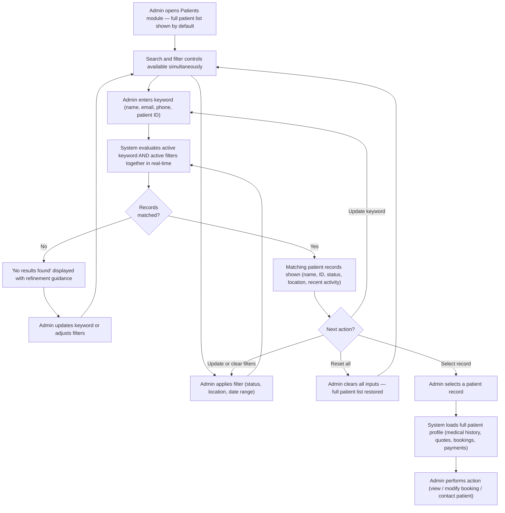
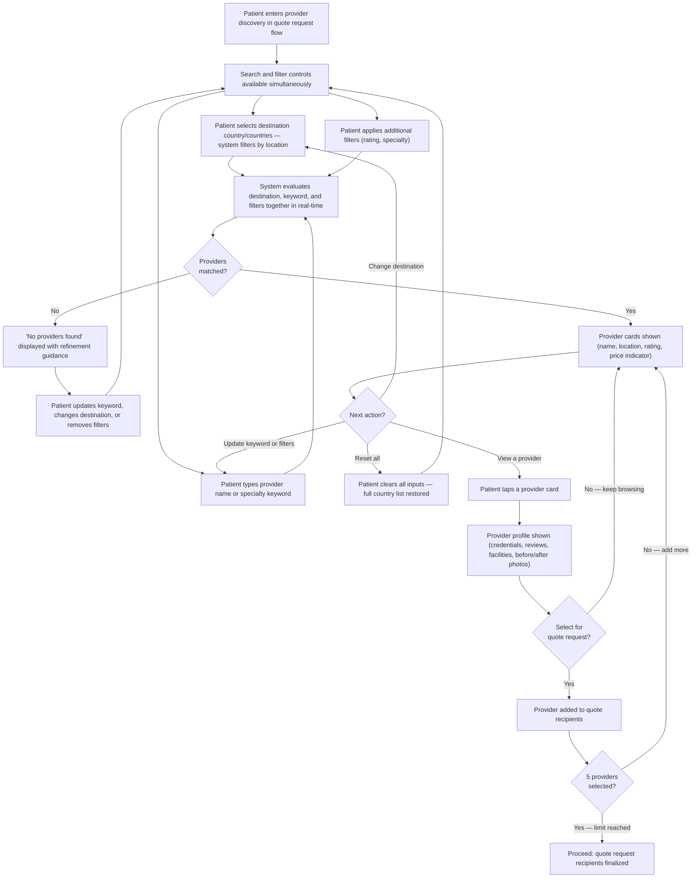
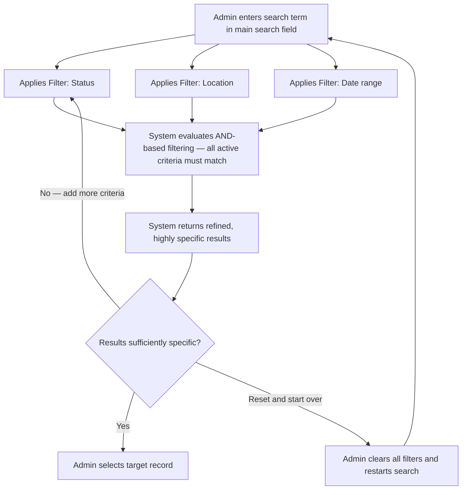
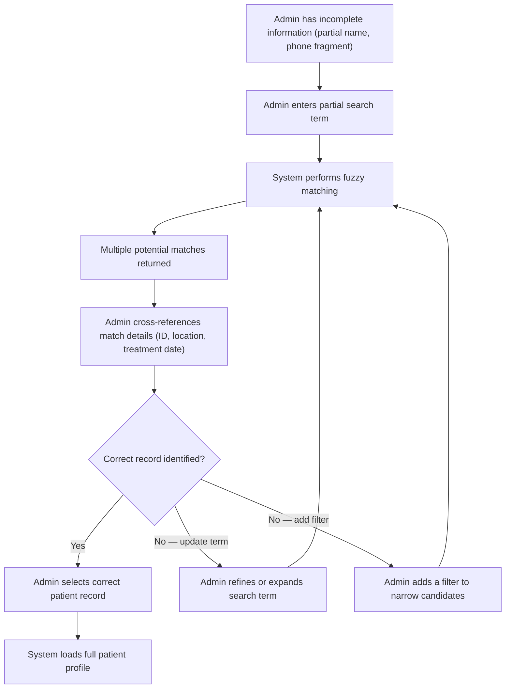
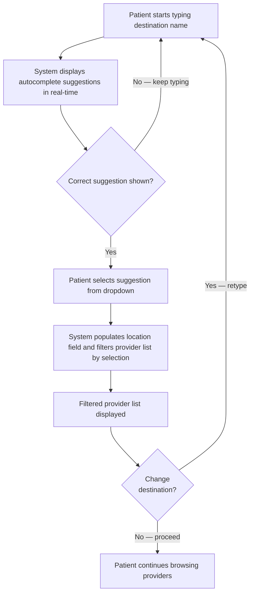
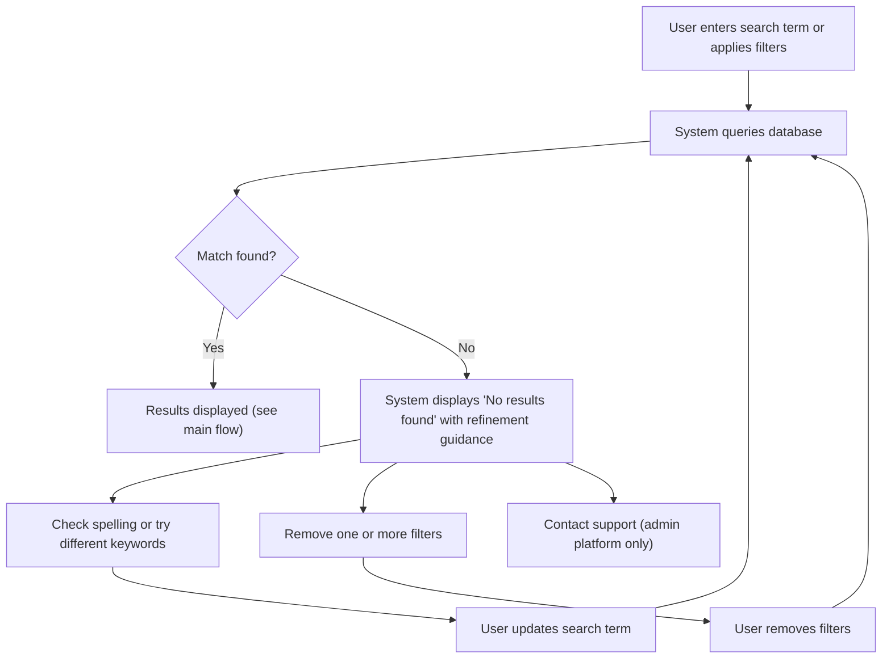
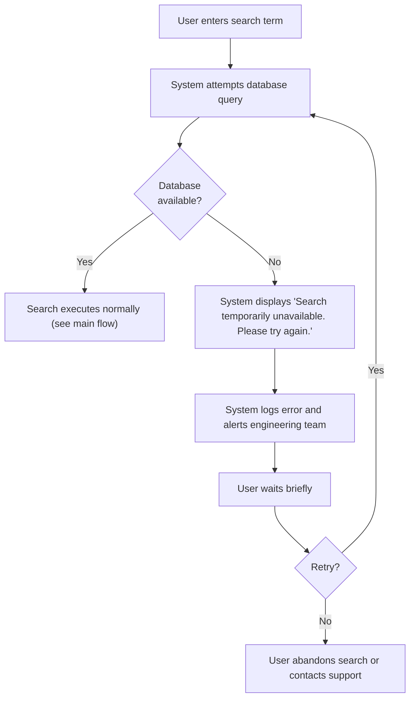

# FR-022 - Search & Filtering

**Module**: P-02: Quote Request & Management | P-06: Communication | P-08: Help & Support | PR-01: Provider Team | PR-02: Inquiry & Quote Management | PR-03: Treatment Execution & Documentation | PR-04: Aftercare Participation | PR-05: Financial Management & Reporting | PR-06: Profile & Settings Management | PR-07: Communication & Messaging | A-01: Patient Management & Oversight | A-02: Provider Management & Onboarding | A-03: Aftercare Team Management | A-05: Billing & Financial Reconciliation | A-06: Discount & Promotion Management | A-07: Affiliate Program Management | A-09: System Settings & Configuration | A-10: Communication Monitoring & Support
**Feature Branch**: `fr022-search-filtering`
**Created**: 2025-11-12
**Status**: ✅ Verified & Approved
**Source**: FR-022 from system-prd.md

---

## Executive Summary

Search and filtering capabilities are critical for enabling users to efficiently navigate large datasets across the Hairline platform. This feature provides context-specific search and filter implementations across all three tenants.

The feature spans all three tenants:

- **Patient Platform**: Provider discovery during quote request flow; help center content browsing; support ticket filtering; messaging inbox search/filtering in the later FR-012 phase
- **Provider Platform**: Inquiry and quote list management; treatment and aftercare case navigation; analytics filtering; package/settings catalog management; support case tracking; messaging list search/filtering in the later FR-012 phase
- **Admin Platform**: Comprehensive patient, provider, and transaction search with advanced filtering across all operational modules

**Priority breakdown**:

- **P1 (MVP)**: Provider Platform operational modules (PR-01 through PR-06, excluding FR-012 messaging) and Admin Platform (A-01, A-02, A-03, A-05, A-06, A-07, A-09, A-10) — these are essential for platform operations and day-to-day provider and admin workflows
- **P2 (Post-MVP)**: Patient-facing provider search (P-02 provider selection) and FR-012 patient/provider messaging search surfaces (P-06 / PR-07) — deferred until their source FR scope is scheduled.

> **Maintenance Convention**: This FR is the single source of truth for all search and filter criteria across the platform. When any source FR updates its filter or search field list, this document must be updated accordingly. See the Master Reference Table in the Screen Specifications section for the full inventory.

---

## Module Scope

### Multi-Tenant Architecture

- **Patient Platform (P-02, P-06, P-08)**: Provider search for quote request (P2); help center and support ticket filtering (P1 - MVP); messaging inbox search/filtering deferred with FR-012 (P2). _(Patient booking list search/filter is pending FR-006 update — see deferred items below.)_
- **Provider Platform (PR-01, PR-02, PR-03, PR-04, PR-05, PR-06, PR-07)**: Search and filtering across provider workflows — team directory, inquiries, quotes, treatment cases, aftercare cases, analytics, packages, reviews, and support cases (P1 - MVP); provider messaging list search/filtering is deferred with FR-012 (PR-07, P2)
- **Admin Platform (A-01, A-02, A-03, A-05, A-06, A-07, A-09, A-10)**: Comprehensive search and filtering across all admin operations — patient management, provider management, aftercare oversight, billing, affiliates, discount codes, system settings, help centre, and communication monitoring (P1 - MVP)
- **Shared Services**: None (search logic implemented within each tenant's backend)

### Multi-Tenant Breakdown

**Patient Platform** [Mixed Priority]:

- **P2 — Post-MVP**: Search providers by name and specialty; filter by country and rating (P-02 quote request flow, per FR-003 Screen 7a)
- **P2 — Post-MVP**: Search and filter messages inbox by provider/content and read status (P-06, per FR-012)
- **P1 — MVP**: Search help center content; filter support tickets by status (P-08)

**Provider Platform** [Mixed Priority]:

- **P1 — MVP / Team Management (PR-01)**: Search and filter team directory by name, role, status. _(Activity log and work queue filter specs are defined in FR-009 Screen 6; see FR-009 as source of truth for those.)_
- **P1 — MVP / Inquiry & Quote Management (PR-02)**: Search and filter inquiries by patient ID, concern, date, alerts, location (patient name excluded from search pre-payment confirmation); search and filter quotes by status, concern, location, alerts
- **P1 — MVP / Treatment Execution (PR-03)**: Search and filter treatment cases by patient ID, name, booking reference; filter by date and clinician
- **P1 — MVP / Aftercare Participation (PR-04)**: Search and filter aftercare cases by patient; filter by milestone, status, and date
- **P1 — MVP / Financial Management (PR-05)**: Filter analytics dashboard by date range and treatment type
- **P1 — MVP / Profile & Settings (PR-06)**: Search Help Centre content globally; filter provider FAQs by topic; filter Resource Library content by category and file type; filter reviews by rating; search and filter support cases by case ID, keywords, status, type, and date range
- **P2 — Post-MVP / Communication & Messaging (PR-07)**: Search and filter provider message threads via FR-012 secure messaging

**Admin Platform (A-01, A-02, A-03, A-05, A-06, A-07, A-09, A-10)** [P1 - MVP]:

- **Patient Search & Filtering (A-01)**: Search patients by name, email, phone, patient ID (HPID format); filter by status, location, registration date
- **Provider Search & Filtering (A-02)**: Search providers by provider name, clinic name, email, and license number; filter by status, featured designation, commission type, and creation/last activity date
- **Aftercare Team Management (A-03)**: Search and filter aftercare cases by patient, milestone status, risk level, specialist assignment, completion rate
- **Billing & Financial Reconciliation (A-05)**: Search and filter transactions, payouts, invoices by date range, amount, provider, status, currency; filter discount codes by usage, ROI, status
- **Discount & Promotion Management (A-06)**: Search and filter discount codes by code, provider participation, status, usage, date range, ROI
- **Affiliate Program Management (A-07)**: Search and filter affiliates by name, code, referral count, commission amount, payout status, performance metrics
- ~~**Analytics & Reporting (A-08)**~~: _Deferred — no admin analytics FR exists yet. Remove from FR-022 scope until an Admin Analytics FR is created and can define the screen-level search/filter spec. TODO: revisit when FR for Admin Analytics is authored._
- **System Settings & Configuration (A-09)**: Search and filter settings by category, version, change history, admin user; filter configurations by module, status, effective date
- **Communication Monitoring & Support (A-10)**: Search and filter conversations by participant, tag, severity, date range, agent assignment, status

**Shared Services**:

- Search functionality implemented within each tenant's backend
- No shared search service required for MVP

### Communication Structure

**In Scope**:

- None - this feature is data query and display only

**Out of Scope**:

- Notifications for saved searches or alerts (future enhancement)
- Real-time search suggestions via messaging (future enhancement)

### Entry Points

**Patient Platform** [Mixed Priority]:

- **P2 / Provider Search**: Accessed when patient begins quote request flow and needs to select destination/providers
- **P2 / Provider Search**: Triggered from "Choose Destination" or "Select Providers" screens
- **P2 / Provider Search**: Available throughout quote request journey for comparison
- **P2 / Messaging**: Accessed from the patient communications inbox once FR-012 messaging is scheduled
- **P1 / Help & Support**: Accessed from the Help & Support hub, Help Center, and My Support Tickets screens

**Provider Platform** [Mixed Priority]:

- **PR-01 (Team)**: Accessed from Provider Dashboard → Team tab → Team Directory (FR-009/Screen 10)
- **PR-02 (Inquiries/Quotes)**: Accessed from Provider Dashboard → Inquiries tab → Inquiry List (FR-003/Screen 9) and Quotes List (FR-004/Screen 2)
- **PR-03 (Treatment)**: Accessed from Provider Dashboard → Treatments tab → In Progress Cases (FR-010/Screen 3)
- **PR-04 (Aftercare)**: Accessed from Provider Dashboard → Aftercare tab → Aftercare Cases List (FR-011/Screen 8)
- **PR-05 (Analytics)**: Accessed from Provider Dashboard → Analytics tab → Analytics Dashboard (FR-014/Screen 1)
- **PR-06 (Profile/Settings)**: Accessed from Provider Dashboard → Profile/Settings section — Packages (FR-024/Screen 4), Help Centre (FR-032/Screen 5), Reviews (FR-032/Screen 1 Tab 5), Support Cases (FR-032/Screen 5.7)
- **PR-07 (Messaging) [P2 - Post-MVP]**: Accessed from the provider secure messaging inbox once FR-012 is scheduled

**Admin Platform** [P1 - MVP]:

- **Module-Specific Search**: Each admin module (A-01 through A-10) provides context-specific search and filtering within its own interface

---

## Business Workflows

### Main Flow 1: Admin Patient Search & Filter (P1 - MVP)

**Actors**: Admin, System
**Trigger**: Admin needs to find patient record(s) for support, inquiry status check, or booking modification — using keyword search, filters, or both
**Outcome**: Admin finds relevant patient(s) and views details

**Flow Diagram**:

### Main Flow 2: Admin Provider Search & Filter (P1 - MVP)

**Actors**: Admin, System
**Trigger**: Admin needs to find provider(s) for onboarding verification, performance review, or billing — using keyword search, filters, or both
**Outcome**: Admin finds relevant provider(s) and views details

**Flow Diagram**:

### Main Flow 3: Patient Provider Search & Filter [P2 - Post-MVP]

**Actors**: Patient, System
**Trigger**: Patient begins quote request and needs to discover and select providers — using destination selection, keyword search, filters, or any combination
**Outcome**: Patient discovers and selects up to 5 providers for a quote request

**Flow Diagram**:

### Alternative Flows

**A1: Admin uses multiple search criteria simultaneously**

- **Trigger**: Admin needs a highly specific patient or provider match and a single search term returns too many unrelated results
- **Outcome**: Admin finds exact record efficiently by stacking filters
- **Flow Diagram**:

**A2: Admin searches by partial information**

- **Trigger**: Admin has incomplete patient information (partial name, phone fragment)
- **Outcome**: Admin finds patient despite incomplete information
- **Flow Diagram**:

**A3: Patient uses autocomplete for location search** [P2 - Post-MVP]

- **Trigger**: Patient begins typing a country or city name in the destination field
- **Outcome**: Faster input with reduced typos and immediate provider filtering
- **Flow Diagram**:

**B1: Search returns no results**

- **Trigger**: Search term or filter combination matches no records
- **Outcome**: Clear feedback guides user to refine or reset criteria
- **Flow Diagram**:

**B2: Search system unavailable (database connection failure)**

- **Trigger**: Backend database connection fails during a search query
- **Outcome**: Graceful error handling with retry capability and engineering alert
- **Flow Diagram**:

---

## Screen Specifications

> **Maintenance Convention**: This section is the **single source of truth** for all search and filter criteria across the Hairline platform. Whenever a source FR is updated — adding, removing, or renaming search fields or filter criteria — the relevant screen entry below **must** be updated to reflect the change. This ensures FR-022 remains the definitive reference for all search and filtering behavior platform-wide. The same living-document protocol applies to FR-020 for notification events: when that catalog changes, FR-020 is updated; when any list screen's filters change, FR-022 is updated.

---

### Master Reference Table

The table below maps every platform screen that requires search and/or filter functionality, organized by tenant, module, and FR. Screen codes use the format `FR-XXX / Screen N` (or `FR-XXX / Screen N / Tab M` for tab-level screens), matching the screen numbering defined in each source FR. Use the screen code to locate the detailed spec below.

| Tenant | Module | FR | Screen Name | Screen Code | Search | Filter | Priority |
|--------|--------|----|-------------|-------------|--------|--------|----------|
| Patient | P-02 | FR-003 | Provider Selection | `FR-003 / Screen 7a` | ✓ | ✓ | P2 |
| Patient | P-02 | FR-005 | Quote Comparison List | `FR-005 / Screen 1` | — | ✓ | P1 |
| Patient | P-06 | FR-012 | Patient Messages Inbox | `FR-012 / Screen 1` | ✓ | ✓ | P2 |
| Patient | P-08 | FR-035 | Help & Support Hub | `FR-035 / Screen 1` | ✓ | — | P1 |
| Patient | P-08 | FR-035 | Help Center | `FR-035 / Screen 2` | ✓ | ✓ | P1 |
| Patient | P-08 | FR-035 | My Support Tickets | `FR-035 / Screen 3` | — | ✓ | P1 |
| Provider | PR-01 | FR-009 | Team Directory | `FR-009 / Screen 10` | ✓ | ✓ | P1 |
| Provider | PR-02 | FR-003 | Provider Inquiry List | `FR-003 / Screen 9` | ✓ | ✓ | P1 |
| Provider | PR-02 | FR-004 | Provider Quote List | `FR-004 / Screen 2` | ✓ | ✓ | P1 |
| Provider | PR-03 | FR-010 | In Progress Cases | `FR-010 / Screen 3` | ✓ | ✓ | P1 |
| Provider | PR-04 | FR-011 | Aftercare Cases List | `FR-011 / Screen 8` | ✓ | ✓ | P1 |
| Provider | PR-05 | FR-014 | Provider Analytics Dashboard | `FR-014 / Screen 1` | — | ✓ | P1 |
| Provider | PR-06 | FR-024 | Provider Package List | `FR-024 / Screen 4` | ✓ | ✓ | P1 |
| Provider | PR-06 | FR-032 | Help Centre | `FR-032 / Screen 5` | ✓ | — | P1 |
| Provider | PR-06 | FR-032 | FAQs | `FR-032 / Screen 5.1` | — | ✓ | P1 |
| Provider | PR-06 | FR-032 | Resource Library | `FR-032 / Screen 5.3` | — | ✓ | P1 |
| Provider | PR-06 | FR-032 | Reviews Tab | `FR-032 / Screen 1 / Tab 5` | — | ✓ | P1 |
| Provider | PR-07 | FR-012 | Provider Messages List | `FR-012 / Screen 3` | ✓ | ✓ | P2 |
| Provider | PR-06 | FR-032 | My Support Cases | `FR-032 / Screen 5.7` | ✓ | ✓ | P1 |
| Admin | A-01 | FR-003 | Hairline Overview Dashboard | `FR-003 / Screen 11` | ✓ | ✓ | P1 |
| Admin | A-01 | FR-004 | Global Quote Table | `FR-004 / Screen 5` | ✓ | ✓ | P1 |
| Admin | A-01 | FR-005 | Quote Acceptance Table | `FR-005 / Screen 5` | — | ✓ | P1 |
| Admin | A-01 | FR-006 | Admin Bookings Table | `FR-006 / Screen 5` | ✓ | ✓ | P1 |
| Admin | A-01 | FR-007 | Patient Payment Progress Dashboard | `FR-007 / Screen 5` | ✓ | ✓ | P1 |
| Admin | A-01 | FR-013 | Review Management Dashboard | `FR-013 / Screen 2` | — | ✓ | P1 |
| Admin | A-01 | FR-016 | Patient Management List | `FR-016 / Screen 1` | ✓ | ✓ | P1 |
| Admin | A-01 | FR-016 | Admin Actions Audit Log | `FR-016 / Screen 7` | — | ✓ | P1 |
| Admin | A-01 | FR-016 | Pending Data Requests | `FR-016 / Screen 8` | ✓ | — | P1 |
| Admin | A-02 | FR-015 | Provider Management List | `FR-015 / Screen 1` | ✓ | ✓ | P1 |
| Admin | A-02 | FR-015 | Provider Reviews Tab | `FR-015 / Screen 3 / Tab 5` | ✓ | ✓ | P1 |
| Admin | A-02 | FR-015 | Provider Documents List | `FR-015 / Screen 3 / Tab 6` | — | ✓ | P1 |
| Admin | A-03 | FR-011 | Admin Aftercare Cases List | `FR-011 / Screen 13` | ✓ | ✓ | P1 |
| Admin | A-05 | FR-007b | Installment Plans List | `FR-007b / Screen 5` | — | ✓ | P1 |
| Admin | A-05 | FR-017 | Patient Billing Invoices | `FR-017 / Screen 4` | ✓ | ✓ | P1 |
| Admin | A-05 | FR-017 | Transaction Search | `FR-017 / Screen 7 / Tab 1` | ✓ | ✓ | P1 |
| Admin | A-05 | FR-017 | Billing Audit Log | `FR-017 / Screen 7 / Tab 2` | — | ✓ | P1 |
| Admin | A-05 | FR-018 | Affiliate Payout History | `FR-018 / Screen 5` | ✓ | ✓ | P1 |
| Admin | A-06 | FR-019 | Discount Code Catalog | `FR-019 / Screen 4` | ✓ | ✓ | P1 |
| Admin | A-07 | FR-018 | Affiliate Management List | `FR-018 / Screen 1` | ✓ | ✓ | P1 |
| Admin | A-09 | FR-024 | Admin Treatment Catalog | `FR-024 / Screen 1` | ✓ | ✓ | P1 |
| Admin | A-09 | FR-025 | Questionnaire Catalog | `FR-025 / Screen 1` | ✓ | ✓ | P1 |
| Admin | A-09 | FR-027 | Legal Documents List | `FR-027 / Screen 1` | — | ✓ | P1 |
| Admin | A-09 | FR-027 | User Acceptance List | `FR-027 / Screen 4A` | ✓ | ✓ | P1 |
| Admin | A-09 | FR-029 | Provider Commission Search | `FR-029 / Screen 5` | ✓ | — | P1 |
| Admin | A-09 | FR-029 | Currency Configuration | `FR-029 / Screen 6` | ✓ | — | P1 |
| Admin | A-09 | FR-030 | Notification Rules Dashboard | `FR-030 / Screen 1` | ✓ | ✓ | P1 |
| Admin | A-09 | FR-031 | Admin Users List | `FR-031 / Screen 1 / Tab 2` | ✓ | ✓ | P1 |
| Admin | A-09 | FR-031 | Roles & Permissions | `FR-031 / Screen 1 / Tab 1` | ✓ | ✓ | P1 |
| Admin | A-09 | FR-031 | Admin Activity Audit Trail | `FR-031 / Screen 5` | — | ✓ | P1 |
| Admin | A-09 | FR-033 | FAQ Management | `FR-033 / Screen 2` | ✓ | ✓ | P1 |
| Admin | A-09 | FR-033 | Article Management | `FR-033 / Screen 3` | ✓ | ✓ | P1 |
| Admin | A-09 | FR-033 | Resource Management | `FR-033 / Screen 4` | ✓ | ✓ | P1 |
| Admin | A-09 | FR-033 | Video Management | `FR-033 / Screen 5` | ✓ | ✓ | P1 |
| Admin | A-10 | FR-012 | Communication Monitoring Center | `FR-012 / Screen 5` | ✓ | ✓ | P1 |
| Admin | A-10 | FR-034 | Support Center Dashboard | `FR-034 / Screen 1` | ✓ | ✓ | P1 |

---

### Control Behavior Standards

The states below apply uniformly to every screen in this document. Individual screen entries list only the field/filter tables. Any screen-specific deviation is noted inline under that screen.

| State | View | Trigger | UI Behavior | System Behavior | Visual Indicator |
|-------|------|---------|-------------|-----------------|------------------|
| Search Inactive | Search | Default; no input in search field | Placeholder text shown; full default list visible | No query fired; list displays default results | Dimmed placeholder text; neutral input border |
| Search Active | Search | User types in search field | Typed text visible; clear (×) button appears | Debounced query fires (300–500ms per screen spec); list filters to matching results | Active input border; clear (×) button visible |
| Filter Inactive | Filter | Default; no filters applied | Filter button in neutral state; no filter chips visible | Default query runs; full result set shown | Neutral filter icon; no chips |
| Filter Active | Filter | One or more filter controls changed from default | Active filter chips shown below filter bar; filter button highlighted | AND-logic applied across all active filters; list narrows; result count updates | Highlighted filter icon; active chips visible |
| Reset Filter | Filter | User taps "Clear Filters" / "Reset" / selects default option | All filter controls return to their default values; chips cleared | All filter parameters cleared; default result set restored | Chips removed; filter icon returns to neutral |

**Filter Logic Note**: AND logic applies _across_ different active filter types simultaneously — a result must satisfy all active filter conditions at once. Within a single multi-select filter field, selected values are combined with OR logic — a result matches if it satisfies _any_ of the selected values for that field. The "OR (within field)" label in the Logic column of multi-select filter tables reflects this within-field OR behavior.

---

### 1. Patient Platform Screens

---

#### Module P-02 — Quote Request & Management

##### FR-003 Inquiry Submission

---

###### FR-003 / Screen 7a: Provider Selection [P2 — Post-MVP]

**Purpose**: Patient searches for and selects providers during the quote request flow.

_For UI state behaviors (inactive, active, reset), see [Control Behavior Standards](#control-behavior-standards) above. Document any screen-specific exceptions inline._

**Search View**

| Field | Type | Placeholder | Debounce | Max Length | Notes |
|-------|------|-------------|----------|------------|-------|
| Provider name / keyword | text | "Search providers…" | 500ms | 50 chars | Case-insensitive; matches provider name and specialty tags |

**Filter View**

| Filter | Type | Options | Default | Logic |
|--------|------|---------|---------|-------|
| Country / Destination | Multi-select chips | Patient's previously selected destination countries | All selected countries | AND within selection |
| Rating | Star selector | All, 4+ stars, 4.5+ stars | All | Min threshold |
| Specialty | Dropdown | Hair Transplant, Beard Transplant, Both | All | Exact match |
| Active Status | Segmented | All, Active Only | Active Only | Single selection |
| Available Capacity | Toggle | Show providers with open appointment slots only | Off | Single flag |

---

##### FR-005 Quote Comparison & Acceptance

---

###### FR-005 / Screen 1: Quote Comparison List [P1 — MVP]

**Purpose**: Patient sorts and filters received quotes for comparison before acceptance.

_For UI state behaviors (inactive, active, reset), see [Control Behavior Standards](#control-behavior-standards) above. Document any screen-specific exceptions inline._

> No search input on this screen — filtering and sorting only.

**Filter View**

| Filter | Type | Options | Default | Logic |
|--------|------|---------|---------|-------|
| Sort By | Dropdown | Price (Low–High), Price (High–Low), Graft Count, Rating, Quote Date | Quote Date (most recent) | Single selection |
| Date Range | Filter chips | Patient's submitted date ranges | All | Narrows to quotes covering that range |

---

#### Module P-06 — Communication

##### FR-012 Secure Messaging

---

###### FR-012 / Screen 1: Patient Messages Inbox [P2 — Post-MVP]

**Purpose**: Patient searches and filters their conversation inbox to find specific messages or providers.

_For UI state behaviors (inactive, active, reset), see [Control Behavior Standards](#control-behavior-standards) above. Document any screen-specific exceptions inline._

**Search View**

| Field | Type | Placeholder | Debounce | Min Length | Notes |
|-------|------|-------------|----------|------------|-------|
| Provider name / message content | text | "Search messages…" | 300ms | 2 chars | Searches across provider name and message body |

**Filter View**

| Filter | Type | Options | Default | Logic |
|--------|------|---------|---------|-------|
| Read Status | Segmented control / tabs | All, Unread, Read | All | Single selection |

---

#### Module P-08 — Help & Support

##### FR-035 Patient Help & Support

---

###### FR-035 / Screen 1: Help & Support Hub [P1 — MVP]

**Purpose**: Patient searches help content from the support entry hub before deciding whether to browse content or open a support request.

_For UI state behaviors (inactive, active, reset), see [Control Behavior Standards](#control-behavior-standards) above. Document any screen-specific exceptions inline._

**Search View**

| Field | Type | Placeholder | Debounce | Notes |
|-------|------|-------------|----------|-------|
| Search Bar | text | "Search help articles..." | 300ms | Full-text search across published patient-audience FAQ and article content; results are relevance-ranked and must surface a Contact Support path when no match is found |

> No filter controls on this screen — search-only entry point into the patient help system.

---

###### FR-035 / Screen 2: Help Center [P1 — MVP]

**Purpose**: Patient searches for help articles and browses content by type.

_For UI state behaviors (inactive, active, reset), see [Control Behavior Standards](#control-behavior-standards) above. Document any screen-specific exceptions inline._

**Search View**

| Field | Type | Placeholder | Debounce | Notes |
|-------|------|-------------|----------|-------|
| Help content search | text | "Search help articles…" | 300ms | Full-text search across all patient-audience FAQs, articles, resources, and videos; auto-suggests results while typing |

**Filter View**

| Filter | Type | Options | Default | Logic |
|--------|------|---------|---------|-------|
| Content Type | Segmented chips / cards | All, FAQs, Articles, Resources, Videos | All | Single selection |
| Article Subtype | Filter chips (conditional) | All, Tutorial Guides, Troubleshooting Tips | All | Shown only when "Articles" type is selected |

---

###### FR-035 / Screen 3: My Support Tickets [P1 — MVP]

**Purpose**: Patient filters their support ticket list by status.

_For UI state behaviors (inactive, active, reset), see [Control Behavior Standards](#control-behavior-standards) above. Document any screen-specific exceptions inline._

> No search input on this screen — filtering only.

**Filter View**

| Filter | Type | Options | Default | Logic |
|--------|------|---------|---------|-------|
| Status | Segmented chips | All, Open, In Progress, Resolved, Closed | All | Single selection |

---

### 2. Provider Platform Screens

---

#### Module PR-01 — Provider Team

##### FR-009 Provider Team Roles

---

###### FR-009 / Screen 10: Team Directory [P1 — MVP]

**Purpose**: Provider searches for and filters team members within the clinic.

_For UI state behaviors (inactive, active, reset), see [Control Behavior Standards](#control-behavior-standards) above. Document any screen-specific exceptions inline._

**Search View**

| Field | Type | Placeholder | Debounce | Notes |
|-------|------|-------------|----------|-------|
| Name / email / status | text | "Search team members…" | 500ms | Supports wildcard; case-insensitive |

**Filter View**

| Filter | Type | Options | Default | Logic |
|--------|------|---------|---------|-------|
| Role | Multi-select | All roles defined in clinic (e.g., Surgeon, Coordinator, Aftercare Specialist) | All | OR (within field) |
| Status | Multi-select | Active, Inactive, Pending Invitation | All | OR (within field) |
| Region | Dropdown | All; admin-defined region list | All | Exact match |
| Role Compatibility | Context filter (conditional) | Shown during reassignment workflows only | — | Filters members eligible for role reassignment |

---

#### Module PR-02 — Inquiry & Quote Management

##### FR-003 Inquiry Submission

---

###### FR-003 / Screen 9: Provider Inquiry List [P1 — MVP]

**Purpose**: Provider searches for and filters incoming patient inquiries.

_For UI state behaviors (inactive, active, reset), see [Control Behavior Standards](#control-behavior-standards) above. Document any screen-specific exceptions inline._

**Search View**

| Field | Type | Placeholder | Debounce | Notes |
|-------|------|-------------|----------|-------|
| Patient ID | text | "Search by patient ID…" | 500ms | Case-insensitive; fuzzy match; patient name excluded from search field until booking payment confirmed |

**Filter View**

| Filter | Type | Options | Default | Logic |
|--------|------|---------|---------|-------|
| Patient Age Range | Range slider | 18–100 | All ages | Min–Max range |
| Concern | Multi-select | Hair Transplant, Beard Transplant, Both | All | OR (within field) |
| Requested Date Range | Date range picker | Custom | All dates | Overlaps with inquiry dates |
| Medical Alerts | Multi-select chips | None, Standard, Critical | All | OR (within field) |
| Patient Location | Dropdown | All; country list from DB | All | Exact match |

---

##### FR-004 Quote Submission

---

###### FR-004 / Screen 2: Provider Quote List [P1 — MVP]

**Purpose**: Provider searches for and filters their submitted quotes across all patient inquiries.

_For UI state behaviors (inactive, active, reset), see [Control Behavior Standards](#control-behavior-standards) above. Document any screen-specific exceptions inline._

**Search View**

| Field | Type | Placeholder | Debounce | Notes |
|-------|------|-------------|----------|-------|
| Patient ID / inquiry / treatment / date / status / location | text | "Search quotes…" | 500ms | Case-insensitive; fuzzy match across all indexed fields; patient name field excluded until booking payment confirmed |

**Filter View**

| Filter | Type | Options | Default | Logic |
|--------|------|---------|---------|-------|
| Quote Status | Multi-select | Draft, Sent, Expired, Withdrawn, Archived, Accepted, Cancelled (Other Accepted), Cancelled (Inquiry Cancelled) | All | OR (within field) |
| Date Range | Date range picker | Custom | All dates | Filters by quote creation date |
| Concern | Multi-select | Hair Transplant, Beard Transplant, Both | All | OR (within field) |
| Patient Location | Dropdown | All; country list from DB | All | Exact match |
| Medical Alerts | Multi-select chips | None, Standard, Critical | All | OR (within field) |

---

#### Module PR-03 — Treatment Execution

##### FR-010 Treatment Execution

---

###### FR-010 / Screen 3: In Progress Cases [P1 — MVP]

**Purpose**: Provider searches for and filters active treatment cases by patient or clinician.

_For UI state behaviors (inactive, active, reset), see [Control Behavior Standards](#control-behavior-standards) above. Document any screen-specific exceptions inline._

**Search View**

| Field | Type | Placeholder | Debounce | Notes |
|-------|------|-------------|----------|-------|
| Patient ID / name / booking reference | text | "Search cases…" | 500ms | Real-time filter; case-insensitive |

**Filter View**

| Filter | Type | Options | Default | Logic |
|--------|------|---------|---------|-------|
| Procedure Date Range | Date range picker | Custom | Current month | Filters by treatment procedure date |
| Clinician | Dropdown | All; clinic's active clinicians | All | Exact match |

---

#### Module PR-04 — Aftercare Participation

##### FR-011 Aftercare Recovery Management

---

###### FR-011 / Screen 8: Aftercare Cases List [P1 — MVP]

**Purpose**: Provider searches for and filters patient aftercare cases managed by their clinic.

_For UI state behaviors (inactive, active, reset), see [Control Behavior Standards](#control-behavior-standards) above. Document any screen-specific exceptions inline._

**Search View**

| Field | Type | Placeholder | Debounce | Notes |
|-------|------|-------------|----------|-------|
| Patient name / ID | text | "Search aftercare cases…" | 500ms | Debounced; case-insensitive |

**Filter View**

| Filter | Type | Options | Default | Logic |
|--------|------|---------|---------|-------|
| Milestone | Dropdown | All; aftercare plan milestone names | All | Exact match |
| Case Status | Multi-select | Active, Overdue, Completed | All | OR (within field) |
| Date Range | Date range picker | Custom | All dates | Filters by aftercare start date |

---

#### Module PR-05 — Financial Management & Reporting

##### FR-014 Provider Analytics & Reporting

---

###### FR-014 / Screen 1: Provider Analytics Dashboard [P1 — MVP]

**Purpose**: Provider filters analytics reports by date range and treatment type.

_For UI state behaviors (inactive, active, reset), see [Control Behavior Standards](#control-behavior-standards) above. Document any screen-specific exceptions inline._

> No search input on this screen — filtering only.

**Filter View**

| Filter | Type | Options | Default | Logic |
|--------|------|---------|---------|-------|
| Date Range | Segmented + custom picker | Last 7 days, Last 30 days, Last 90 days, Last 12 months, Custom | Last 30 days | Single selection |
| Treatment Type | Multi-select | All, FUE, FUT, DHI, Sapphire FUE, and other admin-defined types | All | OR (within field) |
| Benchmarks Toggle | Toggle | Show industry benchmarks overlay | Off | Single flag |

---

#### Module PR-06 — Profile & Settings

##### FR-024 Treatment Package Management

---

###### FR-024 / Screen 4: Provider Package List [P1 — MVP]

**Purpose**: Provider searches for and filters their published treatment packages.

_For UI state behaviors (inactive, active, reset), see [Control Behavior Standards](#control-behavior-standards) above. Document any screen-specific exceptions inline._

**Search View**

| Field | Type | Placeholder | Debounce | Notes |
|-------|------|-------------|----------|-------|
| Package name | text | "Search packages…" | 300ms | Real-time filter; case-insensitive |

**Filter View**

| Filter | Type | Options | Default | Logic |
|--------|------|---------|---------|-------|
| Package Type | Dropdown | All; admin-defined package types | All | Exact match |

---

##### FR-032 Provider Dashboard Settings

---

###### FR-032 / Screen 5: Help Centre [P1 — MVP]

**Purpose**: Provider searches across Help Centre content from the main support landing page.

_For UI state behaviors (inactive, active, reset), see [Control Behavior Standards](#control-behavior-standards) above. Document any screen-specific exceptions inline._

**Search View**

| Field | Type | Placeholder | Max Length | Notes |
|-------|------|-------------|------------|-------|
| Search Bar | text | Global Help Centre search | 200 chars | Global search across provider Help Centre content with autocomplete suggestions |

> No additional filter controls on this landing screen — topic and content-specific filtering occurs in the relevant Help Centre sub-screens.

---

###### FR-032 / Screen 5.1: FAQs [P1 — MVP]

**Purpose**: Provider filters FAQ content by topic within the Help Centre.

_For UI state behaviors (inactive, active, reset), see [Control Behavior Standards](#control-behavior-standards) above. Document any screen-specific exceptions inline._

> No dedicated search input on this screen — FAQ discovery is driven by the global Help Centre search on `FR-032 / Screen 5`, plus the topic filter below.

**Filter View**

| Filter | Type | Options | Default | Logic |
|--------|------|---------|---------|-------|
| FAQ Topic | Category filter | Admin-defined FAQ topics (for example Quote Management, Payment Settings, Aftercare) | All topics | Exact topic filter; updates list instantly |

---

###### FR-032 / Screen 5.3: Resource Library [P1 — MVP]

**Purpose**: Provider narrows downloadable Help Centre resources by category and file type.

_For UI state behaviors (inactive, active, reset), see [Control Behavior Standards](#control-behavior-standards) above. Document any screen-specific exceptions inline._

> No dedicated search input is specified on this screen. Resource discovery uses the global Help Centre search on `FR-032 / Screen 5`, while this screen provides category/file-type filtering for the visible resource list.

**Filter View**

| Filter | Type | Options | Default | Logic |
|--------|------|---------|---------|-------|
| Resource Category | Filter | Admin-defined resource categories (for example Templates, Documents, Forms) | All | Exact category filter |
| File Type | Filter | Admin-defined file types (for example PDF, DOCX, XLSX) | All | Exact file-type filter |

---

###### FR-032 / Screen 1 / Tab 5: Reviews Tab [P1 — MVP]

**Purpose**: Provider filters their patient reviews by star rating.

_For UI state behaviors (inactive, active, reset), see [Control Behavior Standards](#control-behavior-standards) above. Document any screen-specific exceptions inline._

> No search input on this screen — filtering only.

**Filter View**

| Filter | Type | Options | Default | Logic |
|--------|------|---------|---------|-------|
| Rating | Multi-select star chips | 5★, 4★, 3★, 2★, 1★ | All ratings | OR (within field) |
| Sort | Dropdown | Most recent, Highest rated, Lowest rated, Oldest first | Most recent | Single selection |

---

#### Module PR-07 — Communication & Messaging

##### FR-012 Secure Messaging

---

###### FR-012 / Screen 3: Provider Messages List [P2 — Post-MVP]

**Purpose**: Provider searches for and filters their patient conversations from the header messages list.

_For UI state behaviors (inactive, active, reset), see [Control Behavior Standards](#control-behavior-standards) above. Document any screen-specific exceptions inline._

**Search View**

| Field | Type | Placeholder | Min Length | Debounce | Notes |
|-------|------|-------------|-----------|----------|-------|
| Patient name / inquiry or quote ID / message content | text | "Search messages…" | 2 chars | 300ms | Filters the conversation list in real time; case-insensitive fuzzy match across patient name, inquiry/quote ID, and message content |

**Filter View**

| Filter | Type | Options | Default | Logic |
|--------|------|---------|---------|-------|
| Read Status | Toggle | All, Unread Only | All | Exact match |
| Date Range | Dropdown | Today, Last 7 days, Last 30 days, All | All | Filters by activity date |
| Service Type | Dropdown | All; options from service catalog | All | Exact match |

---

###### FR-032 / Screen 5.7: My Support Cases [P1 — MVP]

**Purpose**: Provider searches for and filters support cases they have submitted.

_For UI state behaviors (inactive, active, reset), see [Control Behavior Standards](#control-behavior-standards) above. Document any screen-specific exceptions inline._

**Search View**

| Field | Type | Placeholder | Min Length | Debounce | Notes |
|-------|------|-------------|-----------|----------|-------|
| Case ID / title / keywords | text | "Search cases…" | 3 chars | 300ms | Real-time search across Case ID, Title, Description, Message content |

**Filter View**

| Filter | Type | Options | Default | Logic |
|--------|------|---------|---------|-------|
| Status | Multi-select | Open, In Progress, Resolved, Closed | Open + In Progress | OR (within field) |
| Type | Multi-select | Support Request, Feedback | All types | OR (within field) |
| Date Range | Date range picker | Custom | Last 90 days | Filters by case creation date |

---

### 3. Admin Platform Screens

---

#### Module A-01 — Patient Management & Oversight

##### FR-003 Inquiry Submission

---

###### FR-003 / Screen 11: Hairline Overview Dashboard [P1 — MVP]

**Purpose**: Admin searches for and filters all patient inquiries across all providers.

_For UI state behaviors (inactive, active, reset), see [Control Behavior Standards](#control-behavior-standards) above. Document any screen-specific exceptions inline._

**Search View**

| Field | Type | Placeholder | Debounce | Notes |
|-------|------|-------------|----------|-------|
| Patient ID / name | text | "Search by patient ID or name…" | 500ms | Case-insensitive; fuzzy match |

**Filter View**

| Filter | Type | Options | Default | Logic |
|--------|------|---------|---------|-------|
| Patient Location | Dropdown | All; country list from DB | All | Exact match |
| Provider Location | Dropdown | All; country list from DB | All | Exact match |
| Inquiry Stage | Multi-select | Inquiry, Quoted, Accepted, Scheduled, Cancelled | All | OR (within field) |
| Payment Status | Dropdown | All, Paid, Unpaid, Partial | All | Exact match |
| Date Range | Date range picker | Custom | All dates | Filters by inquiry submission date |

---

##### FR-004 Quote Submission

---

###### FR-004 / Screen 5: Global Quote Table [P1 — MVP]

**Purpose**: Admin searches for and filters all quotes across all providers and patients.

_For UI state behaviors (inactive, active, reset), see [Control Behavior Standards](#control-behavior-standards) above. Document any screen-specific exceptions inline._

**Search View**

| Field | Type | Placeholder | Debounce | Notes |
|-------|------|-------------|----------|-------|
| Patient ID / name / provider / inquiry | text | "Search quotes…" | 500ms | Case-insensitive; fuzzy match across all indexed fields |

**Filter View**

| Filter | Type | Options | Default | Logic |
|--------|------|---------|---------|-------|
| Quote Status | Multi-select | Draft, Sent, Expired, Withdrawn, Archived, Accepted, Cancelled (Other Accepted), Cancelled (Inquiry Cancelled) | All | OR (within field) |
| Date Range | Date range picker | Custom | All dates | Filters by quote creation date |
| Concern | Multi-select | Hair Transplant, Beard Transplant, Both | All | OR (within field) |
| Patient Location | Dropdown | All; country list from DB | All | Exact match |
| Provider | Dropdown | All; provider list from DB | All | Exact match |
| Medical Alerts | Multi-select chips | None, Standard, Critical | All | OR (within field) |

---

##### FR-005 Quote Comparison & Acceptance

---

###### FR-005 / Screen 5: Quote Acceptance Table [P1 — MVP]

**Purpose**: Admin filters the quote acceptance overview by acceptance status.

_For UI state behaviors (inactive, active, reset), see [Control Behavior Standards](#control-behavior-standards) above. Document any screen-specific exceptions inline._

> No search input on this screen — filtering only.

**Filter View**

| Filter | Type | Options | Default | Logic |
|--------|------|---------|---------|-------|
| Acceptance Status | Multi-select | Active, Superseded by Cancellation | Active | OR (within field) |

---

##### FR-006 Booking & Scheduling

---

###### FR-006 / Screen 5: Admin Bookings Table [P1 — MVP]

**Purpose**: Admin searches for and filters all bookings across the platform.

_For UI state behaviors (inactive, active, reset), see [Control Behavior Standards](#control-behavior-standards) above. Document any screen-specific exceptions inline._

**Search View**

| Field | Type | Placeholder | Debounce | Notes |
|-------|------|-------------|----------|-------|
| Booking reference / patient name / patient email / provider name | text | "Search bookings…" | 500ms | Case-insensitive; fuzzy match |

**Filter View**

| Filter | Type | Options | Default | Logic |
|--------|------|---------|---------|-------|
| Booking Status | Multi-select | All, Pending Payment, Confirmed, In Progress, Completed, Cancelled | All | OR (within field) |
| Provider | Dropdown | All; provider list from DB | All | Exact match |
| Date Range | Date range picker | Custom | All dates | Filters by booking date |
| Treatment Type | Dropdown | All, Hair Transplant, Beard Transplant, Both | All | Exact match |
| Payment Status | Multi-select | All, Unpaid, Deposit Paid, Fully Paid, Overdue | All | OR (within field) |
| Deposit Status | Multi-select | Pending, Paid, Partial | All | OR (within field) |

---

##### FR-007 Payment Processing

---

###### FR-007 / Screen 5: Patient Payment Progress Dashboard [P1 — MVP]

**Purpose**: Admin searches for and filters payment records by booking, patient, and payment status.

_For UI state behaviors (inactive, active, reset), see [Control Behavior Standards](#control-behavior-standards) above. Document any screen-specific exceptions inline._

**Search View**

| Field | Type | Placeholder | Debounce | Notes |
|-------|------|-------------|----------|-------|
| Booking ID / patient name | text | "Search by booking ID or patient name…" | 500ms | Case-insensitive; fuzzy match |

**Filter View**

| Filter | Type | Options | Default | Logic |
|--------|------|---------|---------|-------|
| Provider | Dropdown | All; provider list from DB | All | Exact match |
| Deposit Status | Multi-select | Pending, Paid, Partial | All | OR (within field) |
| Payment Status | Multi-select | Unpaid, Deposit Only, Installments Active, Full Paid, Overdue | All | OR (within field) |
| Final Payment Status | Multi-select | Not Due, Due, Paid, Overdue | All | OR (within field) |
| Overdue Flag | Toggle | Show overdue only | Off | Single flag |
| Date Range | Date range picker | Custom | All dates | Filters by booking date |

---

##### FR-013 Reviews & Ratings

---

###### FR-013 / Screen 2: Review Management Dashboard [P1 — MVP]

**Purpose**: Admin filters all platform reviews by date, provider, rating, status, and flag.

_For UI state behaviors (inactive, active, reset), see [Control Behavior Standards](#control-behavior-standards) above. Document any screen-specific exceptions inline._

> No search input on this screen — filtering only.

**Filter View**

| Filter | Type | Options | Default | Logic |
|--------|------|---------|---------|-------|
| Date Range | Date range picker | Custom | All dates | Filters by review submission date |
| Provider | Dropdown | All; provider list from DB | All | Exact match |
| Rating | Multi-select star chips | 5★, 4★, 3★, 2★, 1★ | All | OR (within field) |
| Review Status | Multi-select | Pending Moderation, Published, Rejected | All | OR (within field) |
| Flagged | Toggle | Show flagged only | Off | Single flag |

---

##### FR-016 Admin Patient Management

---

###### FR-016 / Screen 1: Patient Management List [P1 — MVP]

**Purpose**: Admin searches for and filters all registered patients across the platform.

_For UI state behaviors (inactive, active, reset), see [Control Behavior Standards](#control-behavior-standards) above. Document any screen-specific exceptions inline._

**Search View**

| Field | Type | Placeholder | Debounce | Min Length | Notes |
|-------|------|-------------|----------|------------|-------|
| Name / email / patient code (HPID) / phone | text | "Search patients…" | 500ms | 2 chars | Case-insensitive; fuzzy match |

**Filter View**

| Filter | Type | Options | Default | Logic |
|--------|------|---------|---------|-------|
| Status | Multi-select | Inquiry, Quoted, Accepted, Scheduled, In-Progress, Aftercare, Completed, Cancelled, Suspended | All | OR (within field) |
| Date Range | Date range picker + type toggle | Custom; toggle: Registration Date / Last Activity | All dates — Registration Date | Filters by selected date type |
| Location | Dropdown | All; country list from DB | All | Exact match |
| Provider | Dropdown | All; provider list from DB | All | Exact match |

---

###### FR-016 / Screen 7: Admin Actions Audit Log [P1 — MVP]

**Purpose**: Admin searches for and filters the patient data access and modification audit log.

_For UI state behaviors (inactive, active, reset), see [Control Behavior Standards](#control-behavior-standards) above. Document any screen-specific exceptions inline._

> No search input on this screen — filtering only.

**Filter View**

| Filter | Type | Options | Default | Logic |
|--------|------|---------|---------|-------|
| Action Type | Multi-select | View, Edit, Export, Access Request, Deletion Request, Override, and others per FR-016 | All | OR (within field) |
| Date Range | Date range picker | Custom | All dates | Filters by action timestamp |
| Admin User | Dropdown | All; admin user list | All | Exact match |
| Show Only My Actions | Toggle | On / Off | Off | Filters to current admin's actions only |

---

###### FR-016 / Screen 8: Pending Data Requests [P1 — MVP]

**Purpose**: Admin searches the pending patient data access and deletion request queue.

_For UI state behaviors (inactive, active, reset), see [Control Behavior Standards](#control-behavior-standards) above. Document any screen-specific exceptions inline._

**Search View**

| Field | Type | Placeholder | Debounce | Notes |
|-------|------|-------------|----------|-------|
| Patient name / email / HPID | text | "Search requests…" | 500ms | Debounced; case-insensitive; searches within Pending Admin Review queue |

> No additional filter controls — this screen is pre-filtered to Status = Pending Admin Review by default.

---

#### Module A-02 — Provider Management & Onboarding

##### FR-015 Provider Management

---

###### FR-015 / Screen 1: Provider Management List [P1 — MVP]

**Purpose**: Admin searches for and filters all provider accounts.

_For UI state behaviors (inactive, active, reset), see [Control Behavior Standards](#control-behavior-standards) above. Document any screen-specific exceptions inline._

**Search View**

| Field | Type | Placeholder | Debounce | Max Length | Notes |
|-------|------|-------------|----------|------------|-------|
| Provider name / clinic name / email / license number | text | "Search providers…" | 500ms | 200 chars | Case-insensitive; fuzzy match |

**Filter View**

| Filter | Type | Options | Default | Logic |
|--------|------|---------|---------|-------|
| Status | Multi-select | Draft, Active, Suspended, Deactivated | All | OR (within field) |
| Featured | Checkbox | Featured only | Off | Single flag |
| Commission Type | Dropdown | All, Percentage, Flat Rate | All | Exact match |
| Date Range | Date range picker + type toggle | Custom; toggle: Creation Date / Last Activity | All dates — Creation Date | Filters by selected date type |

---

###### FR-015 / Screen 3 / Tab 5: Provider Reviews Tab [P1 — MVP]

**Purpose**: Admin searches for and filters reviews within a provider's profile.

_For UI state behaviors (inactive, active, reset), see [Control Behavior Standards](#control-behavior-standards) above. Document any screen-specific exceptions inline._

**Search View**

| Field | Type | Placeholder | Debounce | Notes |
|-------|------|-------------|----------|-------|
| Review keyword | text | "Search reviews…" | 500ms | Fuzzy match on review content |

**Filter View**

| Filter | Type | Options | Default | Logic |
|--------|------|---------|---------|-------|
| Rating | Multi-select star chips | 5★, 4★, 3★, 2★, 1★ | All ratings | OR (within field) |

---

###### FR-015 / Screen 3 / Tab 6: Provider Documents List [P1 — MVP]

**Purpose**: Admin filters provider-submitted documents by type and uploader.

_For UI state behaviors (inactive, active, reset), see [Control Behavior Standards](#control-behavior-standards) above. Document any screen-specific exceptions inline._

> No search input on this screen — filtering only.

**Filter View**

| Filter | Type | Options | Default | Logic |
|--------|------|---------|---------|-------|
| Document Type | Dropdown | All; admin-defined document types (e.g., Medical License, Insurance, Certification) | All | Exact match |
| Uploaded By | Dropdown | All, Provider, Admin | All | Exact match |

---

#### Module A-03 — Aftercare Team Management

##### FR-011 Aftercare Recovery Management

---

###### FR-011 / Screen 13: Admin Aftercare Cases List [P1 — MVP]

**Purpose**: Admin searches for and filters all aftercare cases across all providers.

_For UI state behaviors (inactive, active, reset), see [Control Behavior Standards](#control-behavior-standards) above. Document any screen-specific exceptions inline._

**Search View**

| Field | Type | Placeholder | Debounce | Notes |
|-------|------|-------------|----------|-------|
| Case ID | text | "Search by case ID…" | 500ms | Searchable; sortable |

**Filter View**

| Filter | Type | Options | Default | Logic |
|--------|------|---------|---------|-------|
| Provider | Dropdown | All; provider list from DB | All | Exact match |
| Milestone | Dropdown | All; milestone names from aftercare plan templates | All | Exact match |
| Case Status | Multi-select | Active, Overdue, Completed | All | OR (within field) |
| Date Range | Date range picker | Custom | All dates | Filters by aftercare start date |
| Risk Level | Multi-select | High, Medium, Low | All | OR (within field) |
| Specialist Assignment | Dropdown | All; aftercare specialists from DB | All | Exact match |
| Completion Rate | Range slider | 0–100% | All | Min threshold |

---

#### Module A-05 — Billing & Financial Reconciliation

##### FR-007b Payment Installments

---

###### FR-007b / Screen 5: Installment Plans List [P1 — MVP]

**Purpose**: Admin filters installment plans by plan status and procedure date range.

_For UI state behaviors (inactive, active, reset), see [Control Behavior Standards](#control-behavior-standards) above. Document any screen-specific exceptions inline._

> No search input on this screen — filtering only.

**Filter View**

| Filter | Type | Options | Default | Logic |
|--------|------|---------|---------|-------|
| Plan Status | Multi-select | Active, Completed, Overdue, Defaulted | All | OR (within field) |
| Procedure Date Range | Date range picker | Custom | All dates | Filters by procedure date; default sort is nearest upcoming first, overdue/defaulted at top |

---

##### FR-017 Admin Billing & Finance

---

###### FR-017 / Screen 4: Patient Billing Invoices [P1 — MVP]

**Purpose**: Admin searches for and filters patient invoices by status and date.

_For UI state behaviors (inactive, active, reset), see [Control Behavior Standards](#control-behavior-standards) above. Document any screen-specific exceptions inline._

**Search View**

| Field | Type | Placeholder | Debounce | Notes |
|-------|------|-------------|----------|-------|
| Patient name | text | "Search by patient name…" | 500ms | Case-insensitive; fuzzy match |

**Filter View**

| Filter | Type | Options | Default | Logic |
|--------|------|---------|---------|-------|
| Payment Status | Multi-select | Pending, Partial, Paid, Overdue, Refunded, At Risk | All | OR (within field) |
| Date Range | Date range picker | Custom | Last 30 days | Filters by invoice date |
| Currency | Dropdown | All; configured currency list | All | Exact match |
| Payment Method | Dropdown | All, Full Payment, Installment | All | Exact match |

---

###### FR-017 / Screen 7 / Tab 1: Transaction Search [P1 — MVP]

**Purpose**: Admin searches for any financial transaction using multiple lookup fields and narrows results by type, date, and status.

_For UI state behaviors (inactive, active, reset), see [Control Behavior Standards](#control-behavior-standards) above. Document any screen-specific exceptions inline._

**Search View**

| Field | Type | Placeholder | Debounce | Notes |
|-------|------|-------------|----------|-------|
| Search By (type selector) | Dropdown | Booking Reference, Invoice Number, Patient Name/ID, Provider Name/ID, Affiliate Name/ID | Booking Reference | Determines search context |
| Search Input | text | Auto-updates per "Search By" selection | 500ms | Free-text; case-insensitive; scoped to selected type |

**Filter View**

| Filter | Type | Options | Default | Logic |
|--------|------|---------|---------|-------|
| Record Type | Multi-select | Invoice, Provider Payout, Installment, Refund, Affiliate Commission | All | OR (within field) |
| Date Range | Date range picker | Custom | All dates | Filters by transaction date |
| Status | Multi-select | Dynamically scoped to selected Record Type(s) — see enumeration below | All | OR (within field) |

> **Status options by Record Type** (when multiple Record Types are selected, the union of all applicable statuses is shown):
>
> | Record Type | Status Options |
> |---|---|
> | Invoice | Pending, Partial, Paid, Overdue, Refunded, At Risk |
> | Provider Payout | Pending, Approved, Paid, Voided, Failed |
> | Installment | Active, Completed, Overdue, Defaulted |
> | Refund | Processing, Completed, Failed |
> | Affiliate Commission | Pending, Paid, Failed, Cancelled |

---

###### FR-017 / Screen 7 / Tab 2: Billing Audit Log [P1 — MVP]

**Purpose**: Admin filters the billing action audit log by date, admin user, action type, and entity.

_For UI state behaviors (inactive, active, reset), see [Control Behavior Standards](#control-behavior-standards) above. Document any screen-specific exceptions inline._

> No search input on this screen — filtering only.

**Filter View**

| Filter | Type | Options | Default | Logic |
|--------|------|---------|---------|-------|
| Date Range | Date range picker | Custom | Last 30 days | Filters by action timestamp |
| Admin User | Dropdown | All; admin user list | All | Exact match |
| Action Type | Multi-select | Payout Approved, Payout Unapproved, Payout Voided, Payout Retried, Bulk Approval, Refund Processed, Invoice Generated, Status Overridden, Note Added, Installment Retry, Affiliate Payout Processed, Affiliate Payout Retried, Payout Added to Next Cycle, Reminder Sent, Currency Alert Decision, Re-authentication Verified | All | OR (within field) |
| Affected Entity | Multi-select | Invoice, Provider Payout, Installment, Affiliate Commission, Booking, Currency Alert | All | OR (within field) |
| Entity ID | text (optional) | "Filter by entity ID…" | 500ms | Optional free-text lookup |

---

##### FR-018 Affiliate Management

---

###### FR-018 / Screen 5: Affiliate Payout History [P1 — MVP]

**Purpose**: Admin searches for and filters affiliate payout records.

_For UI state behaviors (inactive, active, reset), see [Control Behavior Standards](#control-behavior-standards) above. Document any screen-specific exceptions inline._

**Search View**

| Field | Type | Placeholder | Debounce | Notes |
|-------|------|-------------|----------|-------|
| Affiliate name / transaction ID / payout month | text | "Search payout history…" | 500ms | Full-text search; case-insensitive |

**Filter View**

| Filter | Type | Options | Default | Logic |
|--------|------|---------|---------|-------|
| Affiliate | Dropdown / autocomplete | All; affiliate list | All | Exact selection |
| Date Range | Date range picker | Custom | All dates | Filters by payout date |
| Payment Status | Multi-select | Pending, Paid, Failed, Cancelled | All | OR (within field) |

---

#### Module A-06 — Discount & Promotion Management

##### FR-019 Promotions & Discount Management

---

###### FR-019 / Screen 4: Discount Code Catalog [P1 — MVP]

**Purpose**: Admin searches for and filters all discount codes (platform-created and provider-created) across the platform.

_For UI state behaviors (inactive, active, reset), see [Control Behavior Standards](#control-behavior-standards) above. Document any screen-specific exceptions inline._

See `fr019-promotions-discounts/prd.md → Screen 4` for the finalized result-table layout, row actions, and acceptance criteria. FR-022 remains the authoritative source for the search/filter contract below.

**Search View**

| Field | Type | Placeholder | Debounce | Notes |
|-------|------|-------------|----------|-------|
| Code / keyword | text | "Search discount codes…" | 500ms | Case-insensitive; fuzzy match on discount code text and keyword |

**Filter View**

| Filter | Type | Options | Default | Logic |
|--------|------|---------|---------|-------|
| Status | Multi-select | Active, Draft, Expired, Paused | All | OR (within field) |
| Provider Participation | Dropdown | All; provider list from DB | All | Exact match |
| Date Range | Date range picker | Custom | All dates | Filters by active window overlap |
| Usage | Range | 0–Max | All | Min–Max usage count |
| ROI | Dropdown | All; admin-defined ROI tiers | All | Exact match |

---

#### Module A-07 — Affiliate Program Management

##### FR-018 Affiliate Management

---

###### FR-018 / Screen 1: Affiliate Management List [P1 — MVP]

**Purpose**: Admin searches for and filters affiliate accounts.

_For UI state behaviors (inactive, active, reset), see [Control Behavior Standards](#control-behavior-standards) above. Document any screen-specific exceptions inline._

**Search View**

| Field | Type | Placeholder | Debounce | Notes |
|-------|------|-------------|----------|-------|
| Affiliate name / email | text | "Search affiliates…" | 500ms | Case-insensitive; fuzzy match |

**Filter View**

| Filter | Type | Options | Default | Logic |
|--------|------|---------|---------|-------|
| Status | Multi-select | Active, Suspended, Inactive | All | OR (within field) |

---

#### Module A-09 — System Settings & Configuration

##### FR-024 Treatment Package Management

---

###### FR-024 / Screen 1: Admin Treatment Catalog [P1 — MVP]

**Purpose**: Admin searches for and filters the global treatment catalog.

_For UI state behaviors (inactive, active, reset), see [Control Behavior Standards](#control-behavior-standards) above. Document any screen-specific exceptions inline._

**Search View**

| Field | Type | Placeholder | Debounce | Notes |
|-------|------|-------------|----------|-------|
| Treatment name | text | "Search treatments…" | 300ms | Real-time filter; case-insensitive |

**Filter View**

| Filter | Type | Options | Default | Logic |
|--------|------|---------|---------|-------|
| Treatment Type | Dropdown | All; admin-defined treatment types | All | Exact match |

---

##### FR-025 Medical Questionnaire Management

---

###### FR-025 / Screen 1: Questionnaire Catalog [P1 — MVP]

**Purpose**: Admin searches for and filters the questionnaire set catalog.

_For UI state behaviors (inactive, active, reset), see [Control Behavior Standards](#control-behavior-standards) above. Document any screen-specific exceptions inline._

**Search View**

| Field | Type | Placeholder | Debounce | Notes |
|-------|------|-------------|----------|-------|
| Set name keyword | text | "Search questionnaire sets…" | 500ms | Fuzzy match on set name; case-insensitive |

**Filter View**

| Filter | Type | Options | Default | Logic |
|--------|------|---------|---------|-------|
| Context Type | Dropdown | All, Inquiry, Aftercare, Multi-Context | All | Exact match |
| Status | Multi-select | Draft, Active, Archived | All | OR (within field) |
| Category | Dropdown | All; admin-defined categories (e.g., Allergies, Cardiovascular) | All | Exact match |

---

##### FR-027 Legal Content Management

---

###### FR-027 / Screen 1: Legal Documents List [P1 — MVP]

**Purpose**: Admin filters the legal document catalog by type, status, and locale.

_For UI state behaviors (inactive, active, reset), see [Control Behavior Standards](#control-behavior-standards) above. Document any screen-specific exceptions inline._

> No search input on this screen — filtering only.

**Filter View**

| Filter | Type | Options | Default | Logic |
|--------|------|---------|---------|-------|
| Document Type | Dropdown | All; admin-defined legal document types (e.g., Terms of Service, Privacy Policy, Consent Form) | All | Exact match |
| Status | Multi-select | Draft, Published, Archived | All | OR (within field) |
| Locale | Dropdown | All; configured locale list | All | Exact match |

---

###### FR-027 / Screen 4A: User Acceptance List [P1 — MVP]

**Purpose**: Admin searches for and filters user acceptance records for legal documents.

_For UI state behaviors (inactive, active, reset), see [Control Behavior Standards](#control-behavior-standards) above. Document any screen-specific exceptions inline._

**Search View**

| Field | Type | Placeholder | Debounce | Notes |
|-------|------|-------------|----------|-------|
| User name / email / user ID | text | "Search users…" | 500ms | Case-insensitive; fuzzy match |

**Filter View**

| Filter | Type | Options | Default | Logic |
|--------|------|---------|---------|-------|
| Acceptance Status | Multi-select | Accepted, Pending | All | OR (within field) |
| Locale | Dropdown | All; configured locale list | All | Exact match |
| Acceptance Timestamp | Date range picker | Custom | All dates | Filters by date of acceptance |
| Reminder Status | Multi-select | Not Sent, Sent, Acknowledged | All | OR (within field) |

---

##### FR-029 Payment System Config

---

###### FR-029 / Screen 5: Provider Commission Search [P1 — MVP]

**Purpose**: Admin searches for a specific provider when configuring provider-specific commission rates.

_For UI state behaviors (inactive, active, reset), see [Control Behavior Standards](#control-behavior-standards) above. Document any screen-specific exceptions inline._

**Search View**

| Field | Type | Placeholder | Debounce | Notes |
|-------|------|-------------|----------|-------|
| Provider name / ID | text | "Search provider by name or ID…" | 500ms | Returns provider record for commission configuration |

> No filter controls — search-only functionality for provider selection.

---

###### FR-029 / Screen 6: Currency Configuration [P1 — MVP]

**Purpose**: Admin searches for a currency by code or name when configuring platform currencies.

_For UI state behaviors (inactive, active, reset), see [Control Behavior Standards](#control-behavior-standards) above. Document any screen-specific exceptions inline._

**Search View**

| Field | Type | Placeholder | Debounce | Max Length | Notes |
|-------|------|-------------|----------|------------|-------|
| Currency code / name | text | "Filter currencies by code or name…" | 300ms | 100 chars | Real-time filter of currency list |

> No filter controls — search/filter input only for narrowing the currency list.

---

##### FR-030 Notification Rules Config

---

###### FR-030 / Screen 1: Notification Rules Dashboard [P1 — MVP]

**Purpose**: Admin searches for and filters notification rules by event category and rule status.

_For UI state behaviors (inactive, active, reset), see [Control Behavior Standards](#control-behavior-standards) above. Document any screen-specific exceptions inline._

**Search View**

| Field | Type | Placeholder | Debounce | Max Length | Notes |
|-------|------|-------------|----------|------------|-------|
| Event name / template name / recipient type | text | "Search rules…" | 500ms | 100 chars | Case-insensitive; fuzzy match |

**Filter View**

| Filter | Type | Options | Default | Logic |
|--------|------|---------|---------|-------|
| Event Category | Dropdown | All, Account/Auth, Inquiry, Quote, Booking/Schedule, Treatment, Payment, Billing/Payouts, Messaging/Support, Aftercare, Reviews, Promotions/Discounts, Provider/Compliance, System/Operations | All | Exact match |
| Rule Status | Multi-select | Active, Paused, Draft | All | OR (within field) |

---

##### FR-031 Admin Access Control

---

###### FR-031 / Screen 1 / Tab 2: Admin Users List [P1 — MVP]

**Purpose**: Admin searches for and filters admin user accounts.

_For UI state behaviors (inactive, active, reset), see [Control Behavior Standards](#control-behavior-standards) above. Document any screen-specific exceptions inline._

**Search View**

| Field | Type | Placeholder | Debounce | Notes |
|-------|------|-------------|----------|-------|
| Name / email | text | "Search admin users…" | 300ms | Real-time filter; case-insensitive |

**Filter View**

| Filter | Type | Options | Default | Logic |
|--------|------|---------|---------|-------|
| Role | Dropdown | All Roles, Super Admin, Aftercare Specialist, Billing Staff, Support Staff | All Roles | Exact match |
| Status | Multi-select | Active, Suspended, Pending Activation, Inactive | All | OR (within field) |

---

###### FR-031 / Screen 1 / Tab 1: Roles & Permissions [P1 — MVP]

**Purpose**: Admin searches for permissions and filters by category or module.

_For UI state behaviors (inactive, active, reset), see [Control Behavior Standards](#control-behavior-standards) above. Document any screen-specific exceptions inline._

**Search View**

| Field | Type | Placeholder | Debounce | Notes |
|-------|------|-------------|----------|-------|
| Permission name | text | "Search permissions…" | 300ms | Real-time filter on permission name |

**Filter View**

| Filter | Type | Options | Default | Logic |
|--------|------|---------|---------|-------|
| Category | Dropdown | All; admin-defined permission categories | All | Exact match |
| Module | Dropdown | All; platform modules (Patient, Provider, Admin, System) | All | Exact match |

---

###### FR-031 / Screen 5: Admin Activity Audit Trail [P1 — MVP]

**Purpose**: Admin filters the admin user activity log by action type, date, and outcome.

_For UI state behaviors (inactive, active, reset), see [Control Behavior Standards](#control-behavior-standards) above. Document any screen-specific exceptions inline._

> No search input on this screen — filtering only.

**Filter View**

| Filter | Type | Options | Default | Logic |
|--------|------|---------|---------|-------|
| Action Type | Multi-select | Platform-defined admin action types (per FR-031) | All | OR (within field) |
| Date Range | Date range picker | Custom | Last 30 days | Filters by action timestamp |
| Outcome | Multi-select | Success, Failed, Denied | All | OR (within field) |

---

##### FR-033 Help Centre Management

---

###### FR-033 / Screen 2: FAQ Management [P1 — MVP]

**Purpose**: Admin searches for and filters FAQ entries in the Help Centre.

_For UI state behaviors (inactive, active, reset), see [Control Behavior Standards](#control-behavior-standards) above. Document any screen-specific exceptions inline._

**Search View**

| Field | Type | Placeholder | Debounce | Notes |
|-------|------|-------------|----------|-------|
| Question text | text | "Search FAQ questions…" | 500ms | Fuzzy match on question content |

**Filter View**

| Filter | Type | Options | Default | Logic |
|--------|------|---------|---------|-------|
| Topic | Dropdown | All; admin-defined FAQ topics | All | Exact match |
| Status | Multi-select | Draft, Published, Archived | All | OR (within field) |
| Audience | Dropdown | All, Patient, Provider | All | Exact match |

---

###### FR-033 / Screen 3: Article Management [P1 — MVP]

**Purpose**: Admin searches for and filters help articles.

_For UI state behaviors (inactive, active, reset), see [Control Behavior Standards](#control-behavior-standards) above. Document any screen-specific exceptions inline._

**Search View**

| Field | Type | Placeholder | Debounce | Notes |
|-------|------|-------------|----------|-------|
| Article title | text | "Search articles…" | 500ms | Fuzzy match on title |

**Filter View**

| Filter | Type | Options | Default | Logic |
|--------|------|---------|---------|-------|
| Article Type | Dropdown | All, Tutorial Guide, Troubleshooting Tip | All | Exact match |
| Category / Tags | Multi-select | Admin-defined article categories | All | OR (within field) |
| Status | Multi-select | Draft, Published, Archived | All | OR (within field) |
| Audience | Dropdown | All, Patient, Provider | All | Exact match |

---

###### FR-033 / Screen 4: Resource Management [P1 — MVP]

**Purpose**: Admin searches for and filters downloadable help resources.

_For UI state behaviors (inactive, active, reset), see [Control Behavior Standards](#control-behavior-standards) above. Document any screen-specific exceptions inline._

**Search View**

| Field | Type | Placeholder | Debounce | Notes |
|-------|------|-------------|----------|-------|
| Resource name | text | "Search resources…" | 500ms | Fuzzy match on name |

**Filter View**

| Filter | Type | Options | Default | Logic |
|--------|------|---------|---------|-------|
| Category | Dropdown | All; admin-defined resource categories | All | Exact match |
| File Type | Multi-select | PDF, Video, Image, Link, and others as configured | All | OR (within field) |
| Status | Multi-select | Draft, Published, Archived | All | OR (within field) |
| Audience | Dropdown | All, Patient, Provider | All | Exact match |

---

###### FR-033 / Screen 5: Video Management [P1 — MVP]

**Purpose**: Admin searches for and filters help videos.

_For UI state behaviors (inactive, active, reset), see [Control Behavior Standards](#control-behavior-standards) above. Document any screen-specific exceptions inline._

**Search View**

| Field | Type | Placeholder | Debounce | Notes |
|-------|------|-------------|----------|-------|
| Video title | text | "Search videos…" | 500ms | Fuzzy match on title |

**Filter View**

| Filter | Type | Options | Default | Logic |
|--------|------|---------|---------|-------|
| Category / Tags | Multi-select | Admin-defined video categories | All | OR (within field) |
| Status | Multi-select | Draft, Published, Archived | All | OR (within field) |
| Source Type | Dropdown | All, Uploaded, YouTube, Vimeo, and other configured sources | All | Exact match |
| Audience | Dropdown | All, Patient, Provider | All | Exact match |

---

#### Module A-10 — Communication Monitoring & Support

##### FR-012 Secure Messaging

---

###### FR-012 / Screen 5: Communication Monitoring Center [P1 — MVP]

**Purpose**: Admin searches for and filters all platform conversations for oversight and support.

_For UI state behaviors (inactive, active, reset), see [Control Behavior Standards](#control-behavior-standards) above. Document any screen-specific exceptions inline._

**Search View**

| Field | Type | Placeholder | Min Length | Debounce | Notes |
|-------|------|-------------|-----------|----------|-------|
| Patient / provider / keyword / inquiry ID | text | "Search conversations…" | 2 chars | 300ms | Searches across all four fields simultaneously |

**Filter View**

| Filter | Type | Options | Default | Logic |
|--------|------|---------|---------|-------|
| Patient | Autocomplete | Matching patient names | None | Exact selection |
| Provider | Autocomplete | Matching provider names | None | Exact selection |
| Service Type | Multi-select | All; platform-defined service types | All | OR (within field) |
| Quote ID | text (optional) | "Filter by quote ID…" | — | Optional exact match |
| Inquiry ID | text (optional) | "Filter by inquiry ID…" | — | Optional exact match |
| Date Range | Date range picker + presets | Custom; Today, Last 7 days, Last 30 days, All | All | Filters by message date |
| Flag Type | Multi-select | Keyword Flagged, Manually Flagged, Intervened, No Flags | All | OR (within field) |
| Conversation Status | Multi-select | Active, Resolved, Escalated | All | OR (within field) |

---

##### FR-034 Support Center Ticketing

---

###### FR-034 / Screen 1: Support Center Dashboard [P1 — MVP]

**Purpose**: Admin searches for and filters all support tickets from patients and providers.

_For UI state behaviors (inactive, active, reset), see [Control Behavior Standards](#control-behavior-standards) above. Document any screen-specific exceptions inline._

**Search View**

| Field | Type | Placeholder | Min Length | Debounce | Notes |
|-------|------|-------------|-----------|----------|-------|
| Case ID / patient name / provider name / email / title keywords | text | "Search support cases…" | 3 chars | 300ms | Real-time search across all listed fields |

**Filter View**

| Filter | Type | Options | Default | Logic |
|--------|------|---------|---------|-------|
| Status | Multi-select | Open, In Progress, Closed, On Hold, Escalated | Open + In Progress | OR (within field) |
| Priority | Multi-select | High, Medium, Low | All | OR (within field) |
| Category | Dropdown | All; admin-defined ticket categories | All | Exact match |
| Ticket Source | Dropdown | All, Patient App, Provider App, Admin Portal | All | Exact match |
| Submitter Type | Dropdown | All, Patient, Provider | All | Exact match |
| Date Range | Date range picker | Custom | Last 30 days | Filters by ticket creation date |
| Assigned Admin | Dropdown | All; admin user list | All | Exact match |

---

## Business Rules

### General Module Rules

- **Rule 1**: All search queries MUST be case-insensitive to improve match rate
- **Rule 2**: Search functionality MUST support fuzzy matching via database full-text indexes (e.g., "Mark P" matches "Mark Patterson"; "Mehmet" matches "Mehmet Yilmaz"; accent-insensitive matching, e.g., "Jose" matches "José")
- **Rule 3**: Search results MUST be paginated to prevent performance degradation with large datasets
- **Rule 4**: Filter selections MUST persist during user session (cleared on logout)
- **Rule 5**: Admin search results MUST display patient/provider status prominently for quick context
- **Rule 6**: Search input fields MUST have debounce (300–500ms depending on screen type — see REQ-022-012) to reduce server load from rapid typing
- **Rule 7**: Autocomplete suggestions MUST be limited to 10 results to avoid overwhelming user
- **Rule 8**: Search history MUST NOT be stored (privacy consideration for admin platform)

### Data & Privacy Rules

- **Privacy Rule 1**: Patient names MUST be excluded from provider-facing search fields and results until booking is confirmed and paid. Provider search for inquiries and quotes is restricted to Patient ID as the only patient identifier prior to payment confirmation (see FR-003/Screen 9 and FR-004/Screen 2)
- **Privacy Rule 2**: Admin search logs MUST be retained for audit purposes (who searched for whom, when)
- **Privacy Rule 3**: Patient contact information MUST NOT be indexed for public search (admin only)
- **Privacy Rule 4**: Provider financial data MUST NOT be searchable by other providers (admin only)
- **Audit Rule**: All admin searches for patient/provider records MUST be logged with admin user ID, timestamp, and search terms

### Admin Editability Rules

**Editable by Admin**:

- Maximum search results per page (default: 25, range: 10-100)
- Default sort order for provider search (Recommended, Rating, Price, Experience)
- Featured provider designation (manually curated list)
- Provider visibility status (active providers appear in search, suspended do not)

**Fixed in Codebase (Not Editable)**:

- Search debounce timing (per REQ-022-012: 300ms for local filters, 500ms for server-query searches)
- Autocomplete result limit (10 suggestions)
- Maximum providers selectable per quote request (5 providers)
- Search query max length (200 chars for admin, 200 chars for provider, 50 chars for patient)

**Configurable with Restrictions**:

- Admin can temporarily disable provider from search results (suspension) but cannot delete provider record
- Admin can feature/unfeature providers in patient search, affecting "Recommended" sort order

### Search Performance Rules

- **Performance Rule 1**: Search queries MUST complete within 300ms for p95 of requests
- **Performance Rule 2**: Database indexes MUST exist on all searchable fields (name, email, phone, location, status)
- **Performance Rule 3**: Search results MUST use pagination to prevent loading excessive data to client
- **Performance Rule 4**: Autocomplete queries MUST be cached for 5 minutes to reduce database load
- **Performance Rule 5**: Complex filters (multi-criteria) MUST execute in single database query (no N+1 queries)

---

## Success Criteria

### Admin Experience Metrics

- **SC-001**: Admins can locate a patient record in under 10 seconds for 90% of searches
- **SC-002**: Admin search returns relevant results in first 25 results for 85% of queries
- **SC-003**: Admins successfully use filters to narrow results in under 3 clicks for 80% of complex searches
- **SC-004**: Admin search interface receives 4.5+ satisfaction rating in internal feedback surveys

### Patient Experience Metrics [P2 - Post-MVP]

- **SC-005**: Patients can discover and select providers in under 2 minutes for 80% of quote requests
- **SC-006**: Patient provider search returns satisfactory options within first 10 results for 75% of searches
- **SC-007**: Patients successfully apply filters to refine provider choices for 60% of searches
- **SC-008**: Patient provider selection process receives 4+ satisfaction rating in post-booking surveys

### System Performance Metrics

- **SC-009**: Search queries complete in under 300ms for 95% of requests (p95 latency)
- **SC-010**: Search system handles 100 concurrent admin searches without degradation
- **SC-011**: Search system handles 500 concurrent patient searches without degradation [P2 - Post-MVP]
- **SC-012**: Autocomplete suggestions return in under 200ms for 95% of requests
- **SC-013**: Database query performance remains under 100ms for indexed searches
- **SC-014**: Zero full table scans on large tables (patients, providers) during search operations

### Operational Efficiency Metrics

- **SC-015**: Admin support response time improves by 40% due to faster patient lookup
- **SC-016**: Admin overhead for patient/provider management reduced by 30% through efficient search
- **SC-017**: Admin search usage grows to 200+ searches per day within first month

### Business Impact Metrics [P2 - Post-MVP]

- **SC-019**: Patient quote request completion rate increases by 20% with improved provider discovery
- **SC-020**: Average providers selected per quote request increases from 2 to 3.5 (improved comparison)
- **SC-021**: Patient-selected providers convert at 25% higher rate than auto-assigned providers
- **SC-022**: Provider search engagement (filters used, profiles viewed) correlates with 15% higher booking rate

---

## Dependencies

### Internal Dependencies (Other FRs/Modules)

- **FR-031 / Module A-09**: Requires admin authentication from A-09: Admin Access Control
  - **Why needed**: All search endpoints require a valid admin JWT session before displaying patient or provider PII
  - **Integration point**: Admin JWT bearer token verified on every search API request; role-based access control enforced per FR-031

- **FR-015 / Module A-02**: Depends on A-02: Provider Management & Onboarding for provider data
  - **Why needed**: Provider search queries provider profiles, credentials, and status
  - **Integration point**: Searches provider database table with joins to staff, certifications, reviews

- **FR-016 / Module A-01**: Depends on A-01: Patient Management & Oversight for patient data
  - **Why needed**: Patient search queries patient profiles, medical history, and booking status
  - **Integration point**: Searches patient database table with joins to inquiries, quotes, bookings

- **FR-003 / Module P-02**: Integrates with P-02: Quote Request & Management for provider selection [P2]
  - **Why needed**: Selected providers from search are added to quote request recipients
  - **Integration point**: Patient app sends selected provider IDs to quote request API

- **Source FR Maintenance Dependencies**: FR-022 is the single source of truth for search/filter specifications across all source FRs listed below. Any screen-level change to a search field or filter criterion in a source FR **must** trigger an update to the FR-022 Master Reference Table and the corresponding screen spec entry here.

  | Tenant | Source FR(s) | Screens Owned by FR-022 |
  |--------|-------------|-------------------------|
  | Patient | FR-003 | Screen 7a (Provider Selection) |
  | Patient | FR-005 | Screen 1 (Quote Comparison List) |
  | Patient | FR-012 | Screen 1 (Patient Messages Inbox) |
  | Patient | FR-035 | Screens 1–3 (Help & Support Hub, Help Center, My Support Tickets) |
  | Provider | FR-003 | Screen 9 (Provider Inquiry List) |
  | Provider | FR-004 | Screen 2 (Provider Quote List) |
  | Provider | FR-009 | Screen 10 (Team Directory) |
  | Provider | FR-010 | Screen 3 (In Progress Cases) |
  | Provider | FR-011 | Screen 8 (Aftercare Cases List) |
  | Provider | FR-012 | Screen 3 (Provider Messages List) |
  | Provider | FR-014 | Screen 1 (Provider Analytics Dashboard) |
  | Provider | FR-024 | Screen 4 (Provider Package List) |
  | Provider | FR-032 | Screens 5, 5.1, 5.3, 1/Tab 5, 5.7 (Help Centre, FAQs, Resource Library, Reviews Tab, My Support Cases) |
  | Admin (A-01) | FR-003 | Screen 11 (Hairline Overview Dashboard) |
  | Admin (A-01) | FR-004 | Screen 5 (Global Quote Table) |
  | Admin (A-01) | FR-005 | Screen 5 (Quote Acceptance Table) |
  | Admin (A-01) | FR-006 | Screen 5 (Admin Bookings Table) |
  | Admin (A-01) | FR-007 | Screen 5 (Patient Payment Progress Dashboard) |
  | Admin (A-01) | FR-013 | Screen 2 (Review Management Dashboard) |
  | Admin (A-01) | FR-016 | Screens 1, 7, 8 (Patient Management List, Audit Log, Pending Data Requests) |
  | Admin (A-02) | FR-015 | Screens 1, 3/Tab 5, 3/Tab 6 (Provider Management List, Reviews Tab, Documents List) |
  | Admin (A-03) | FR-011 | Screen 13 (Admin Aftercare Cases List) |
  | Admin (A-05) | FR-007b | Screen 5 (Installment Plans List) |
  | Admin (A-05) | FR-017 | Screens 4, 7/Tab 1, 7/Tab 2 (Patient Billing Invoices, Transaction Search, Billing Audit Log) |
  | Admin (A-05/A-07) | FR-018 | Screens 1, 5 (Affiliate Management List, Affiliate Payout History) |
  | Admin (A-06) | FR-019 | Screen 4 (Discount Code Catalog) |
  | Admin (A-09) | FR-024 | Screen 1 (Admin Treatment Catalog) |
  | Admin (A-09) | FR-025 | Screen 1 (Questionnaire Catalog) |
  | Admin (A-09) | FR-027 | Screens 1, 4A (Legal Documents List, User Acceptance List) |
  | Admin (A-09) | FR-029 | Screens 5, 6 (Provider Commission Search, Currency Configuration) |
  | Admin (A-09) | FR-030 | Screen 1 (Notification Rules Dashboard) |
  | Admin (A-09) | FR-031 | Screens 1/Tab 1, 1/Tab 2, 5 (Roles & Permissions, Admin Users List, Admin Activity Audit Trail) |
  | Admin (A-09) | FR-033 | Screens 2, 3, 4, 5 (FAQ, Article, Resource, Video Management) |
  | Admin (A-10) | FR-012 | Screen 5 (Communication Monitoring Center) |
  | Admin (A-10) | FR-034 | Screen 1 (Support Center Dashboard) |

### External Dependencies (APIs, Services)

- **External Service 1**: None required for MVP
  - Admin search operates entirely on internal database
  - No third-party search engines (Elasticsearch, Algolia) required for initial launch

- **Future Enhancement**: Elasticsearch or Algolia integration for advanced search [P3]
  - **Purpose**: Enhance beyond MVP fuzzy matching with synonym expansion, advanced typo tolerance (edit-distance algorithms), and relevance ranking — basic fuzzy matching via database full-text indexes is the MVP standard
  - **Integration**: Sync patient/provider data to search index, query search engine instead of database
  - **Failure handling**: Fallback to database fuzzy search if search service unavailable

### Data Dependencies

- **Entity 1**: Active patient records with complete profiles
  - **Why needed**: Cannot search patients if no patient data exists
  - **Source**: Patient registration module (P-01)

- **Entity 2**: Active provider records with complete profiles, credentials, and performance data
  - **Why needed**: Cannot search providers if no provider data exists
  - **Source**: Provider onboarding module (A-02)

- **Entity 3**: Database indexes on searchable fields
  - **Why needed**: Search performance degrades without indexes on large tables
  - **Source**: Database migration scripts (create indexes on patients.name, patients.email, providers.clinic_name, etc.)

---

## Assumptions

### User Behavior Assumptions

- **Assumption 1**: Admins will use search functionality 10-20 times per day for support, oversight, and operations
- **Assumption 2**: Admins will primarily search by patient name or ID, less frequently by email or phone
- **Assumption 3**: Patients will browse 3-5 provider profiles before selecting providers for quote request [P2 - Post-MVP]
- **Assumption 4**: Patients will primarily sort by "Recommended" and filter by rating, less frequently by price [P2 - Post-MVP]
- **Assumption 5**: Admins will use filters for complex queries (e.g., "all aftercare patients in Turkey") 30% of the time

### Technology Assumptions

- **Assumption 1**: Admin platform accessed via modern browsers (Chrome, Firefox, Safari - last 2 versions)
- **Assumption 2**: Patient mobile app has stable internet connection for search queries [P2 - Post-MVP]
- **Assumption 3**: Database supports full-text search indexes (MySQL FULLTEXT — system uses MySQL 8.0+)
- **Assumption 4**: Backend API can handle 100 concurrent search queries without performance degradation
- **Assumption 5**: Client-side pagination and infinite scroll supported by mobile app framework [P2 - Post-MVP]

### Business Process Assumptions

- **Assumption 1**: Admin searches are for legitimate support/oversight purposes (audit logs deter abuse)
- **Assumption 2**: Provider data is kept up-to-date by providers and verified by admin (search reflects accurate info)
- **Assumption 3**: Patient searches for providers occur during quote request flow, not as standalone exploration [P2]
- **Assumption 4**: Provider "Featured" status manually curated by admin based on performance, quality, and partnerships

---

## Implementation Notes

### Technical Considerations

- **Database Indexing**: Create indexes on all searchable fields to ensure query performance:
  - `patients`: name, email, phone, patient_id, status, location, created_at
  - `providers`: clinic_name, location, status, specialty, rating, years_experience
- **Query Optimization**: Use query builder with prepared statements to prevent SQL injection
- **Pagination**: Implement cursor-based or offset-based pagination depending on dataset size
- **Caching**: Cache autocomplete results and frequently accessed search queries (5-minute TTL)
- **Debouncing**: Implement client-side debounce (300–500ms per screen type, per REQ-022-012) to reduce server load from rapid typing
- **Full-Text Search**: Implement MySQL FULLTEXT indexes (system uses MySQL 8.0+) — fuzzy matching via database full-text search is the MVP standard for all search fields. Advanced fuzzy features (synonym expansion, edit-distance algorithms, relevance scoring) are deferred to a P3 Elasticsearch/Algolia integration

### Integration Points

- **Integration 1**: Admin web app sends search queries to backend API via REST
  - **Data format**: JSON payload with search term, filters, pagination params
  - **Authentication**: Admin JWT bearer token in Authorization header
  - **Error handling**: Display user-friendly error messages, retry on network failure

- **Integration 2**: Patient mobile app sends provider search queries to backend API via REST [P2 - Post-MVP]
  - **Data format**: JSON payload with location, filters, sort order, pagination cursor
  - **Authentication**: Patient JWT bearer token
  - **Error handling**: Display loading state, retry on failure, cache results for offline viewing

### Scalability Considerations

- **Current scale**: Expected 50-100 admin searches per day at launch
- **Growth projection**: Anticipate 500+ searches per day within 6 months (as platform grows)
- **Peak load**: Handle 50 concurrent admin searches during business hours
- **Data volume**: Patient database may grow to 100,000+ records within 12 months; provider database to 500+ records
- **Scaling strategy**: Database read replicas for search queries, application-level caching, consider Elasticsearch for >100k records

### Security Considerations

- **Authentication**: All search endpoints require valid JWT authentication (admin or patient session)
- **Authorization**: Role-based access control enforces admin-only access to patient/provider search
- **Audit trail**: Log all admin searches with user ID, timestamp, search terms, and result count
- **Input validation**: Sanitize all search inputs to prevent SQL injection, XSS attacks
- **Rate limiting**: Limit search queries to 100 per hour per user to prevent abuse/scraping
- **Data masking**: Patient PII (email, phone) displayed only to authorized admins with proper permissions

---

## User Scenarios & Testing

### User Story 1 - Admin Patient Lookup for Support (Priority: P1)

An admin receives a patient support escalation/case (via Support Center; see FR-034) asking about quote status. The admin needs to quickly locate the patient's record to view their inquiry history and provide an update.

**Why this priority**: Critical for customer support operations and platform oversight. Admins must be able to find patient records quickly to resolve issues.

**Independent Test**: Can be fully tested by searching for a known patient by name/ID and verifying correct record returned with relevant details.

**Acceptance Scenarios**:

1. **Given** an admin is logged into the Admin Platform, **When** they enter a patient's full name in the search field, **Then** the system returns matching patient(s) with ID, status, location, and last activity date
2. **Given** an admin searches for a patient by patient ID (HPID format), **When** they enter the exact ID, **Then** the system returns the single matching patient record
3. **Given** an admin searches for a patient by partial email, **When** they enter "mark@", **Then** the system returns all patients with emails starting with "mark@"
4. **Given** an admin applies a status filter "Quoted", **When** they perform a search, **Then** the system returns only patients currently in "Quoted" status
5. **Given** search returns multiple results, **When** admin clicks on a patient row, **Then** the system displays full patient details (profile, medical history, quotes, bookings)

---

### User Story 2 - Admin Provider Verification (Priority: P1)

An admin needs to verify a new provider's credentials during onboarding. They search for the provider by clinic name to review submitted licenses, certifications, and insurance documents.

**Why this priority**: Essential for provider onboarding workflow. Admins must efficiently access provider records for verification and approval.

**Independent Test**: Can be tested by searching for a known provider by clinic name and verifying all credentials/documents are accessible from search results.

**Acceptance Scenarios**:

1. **Given** an admin is reviewing pending provider onboarding applications, **When** they search for a provider by clinic name, **Then** the system returns matching provider(s) with location, status, and onboarding progress
2. **Given** an admin needs to find all providers in a specific country, **When** they select "Turkey" from the Location filter, **Then** the system returns only providers whose location matches Turkey
3. **Given** an admin applies a status filter "Draft", **When** they perform a search, **Then** the system returns only providers whose accounts are in Draft status (setup incomplete / awaiting activation)
4. **Given** search returns a provider, **When** admin clicks on the provider row, **Then** the system displays full provider details including credentials, certifications, staff, and documents
5. **Given** an admin wants to approve a provider, **When** they view provider details from search results, **Then** they can access "Approve" action directly from the detail view

---

### User Story 3 - Admin Filters for Aftercare Patients in Specific Location (Priority: P2)

An admin needs to generate a report of all patients currently in aftercare in Turkey to assign additional aftercare specialists due to high volume.

**Why this priority**: Important for operational oversight and resource allocation, but not as urgent as basic search functionality.

**Independent Test**: Can be tested by applying filters (status: "Aftercare", location: "Turkey") and verifying results match expected criteria.

**Acceptance Scenarios**:

1. **Given** an admin needs to filter patients by status and location, **When** they select "Aftercare" status and "Turkey" location filters, **Then** the system returns only patients in aftercare stage located in Turkey
2. **Given** an admin applies multiple filters (status, location, date range), **When** filters are applied, **Then** the system uses AND logic to return only records matching all criteria
3. **Given** an admin wants to clear filters, **When** they click "Reset Filters" button, **Then** all filters are cleared and full unfiltered results are displayed

---

### User Story 4 - Patient Provider Discovery by Location [P2 - Post-MVP] (Priority: P2)

A patient from the UK wants to find providers in Turkey for a hair transplant. They select "Turkey" as the destination and want to view the highest-rated providers with before/after photos.

**Why this priority**: Enhances patient experience and quote request quality, but MVP can function with manual provider selection by admins.

**Independent Test**: Can be tested by selecting Turkey as destination, sorting by rating, and verifying providers are displayed with correct information.

**Acceptance Scenarios**:

1. **Given** a patient is submitting a quote request, **When** they select "Turkey" as the destination country, **Then** the system displays all active providers in Turkey with starting prices in patient's local currency
2. **Given** providers are displayed, **When** the patient sorts by "Rating", **Then** providers are ordered from highest to lowest rating
3. **Given** a patient wants to filter by minimum rating, **When** they select "4.5+ stars" filter, **Then** only providers with 4.5+ average rating are displayed
4. **Given** a patient views provider list, **When** they tap on a provider card, **Then** the system displays full provider profile with credentials, reviews, facility photos, and before/after gallery
5. **Given** a patient selects a provider, **When** they tap "Select Provider" button, **Then** the provider is added to quote request recipients (max 5 selections)

---

### Edge Cases

- **Edge Case 1**: What happens when a patient searches for providers in a country with no active providers?
  - **Handling**: Display "No providers available in [country]. Please try another location or contact support." with link to support chat.

- **Edge Case 2**: How does the system handle an admin searching for a patient with a very common name (e.g., "John Smith")?
  - **Handling**: Display the first page of results (25 per page, per REQ-022-006) with total result count shown (e.g., "500+ results found"). System shows an informational banner: "Many results found. Use filters to narrow down by location, status, or patient ID."

- **Edge Case 3**: What occurs if a patient's search query contains special characters or SQL syntax?
  - **Handling**: Input sanitization removes/escapes special characters; query runs safely without SQL injection risk; user sees results or "No matches found."

- **Edge Case 4**: How does search handle diacritics or accented characters (e.g., "José" vs "Jose")?
  - **Handling**: Search performs accent-insensitive matching (José matches Jose); database collation set to utf8mb4_unicode_ci (MySQL 8.0+).

- **Edge Case 5**: What happens if database index is missing on a searchable field, causing slow queries?
  - **Handling**: Search times out after 10 seconds; error message displayed: "Search taking too long. Please try again or contact support."; error logged for engineering team to investigate.

- **Edge Case 6**: How does the system handle concurrent searches from multiple admins querying the same patient?
  - **Handling**: Database read locks prevent conflicts; each admin sees consistent snapshot of patient data; audit logs capture each admin's search independently.

- **Edge Case 7**: What happens if a patient has multiple accounts with same name/email?
  - **Handling**: Search returns all matching accounts; admin reviews each record to identify correct patient using patient ID, location, or registration date; duplicate account detection flagged in results.

---

## Functional Requirements Summary

### Core Requirements (P1 - MVP)

#### Admin Platform

- **REQ-022-001**: System MUST allow admins to search patients by name, email, phone number, and patient ID (HPID format)
- **REQ-022-002**: System MUST allow admins to filter patients by status, location, registration date range, and provider
- **REQ-022-003**: System MUST allow admins to search providers by provider name, clinic name, email, and license number
- **REQ-022-004**: System MUST allow admins to filter providers by status, featured flag, commission type, and date range
- **REQ-022-010**: System MUST display patient status, location, and last activity date in search results
- **REQ-022-011**: System MUST display provider status, location, rating, and active patient count in search results

#### Provider Platform

- **REQ-022-033**: System MUST allow providers to search their inquiry list by patient ID only (patient name excluded from provider-facing search until booking payment confirmation)
- **REQ-022-034**: System MUST allow providers to filter inquiries by concern, age range, date range, medical alerts, and patient location
- **REQ-022-035**: System MUST allow providers to search their quote list across patient ID, inquiry, treatment, date, status, and location fields (patient name excluded until booking payment confirmation)
- **REQ-022-036**: System MUST allow providers to filter quotes by status, date range, concern, patient location, and medical alerts
- **REQ-022-037**: System MUST allow providers to search treatment cases by patient ID, name, and booking reference
- **REQ-022-038**: System MUST allow providers to filter treatment cases by procedure date range and clinician
- **REQ-022-039**: System MUST allow providers to search and filter aftercare cases by patient name/ID, milestone, status, and date range
- **REQ-022-040**: System MUST allow providers to filter their analytics dashboard by date range and treatment type
- **REQ-022-041**: System MUST allow providers to search and filter their package list by name and package type
- **REQ-022-042**: System MUST allow providers to filter their reviews by star rating
- **REQ-022-043**: System MUST allow providers to search and filter support cases by case ID, keywords, status, type, and date range
- **REQ-022-044**: System MUST allow providers to search team members by name, email, role, and status

#### Patient Platform (P1 Screens)

- **REQ-022-051**: System MUST allow patients to search help center content with full-text search and auto-suggest
- **REQ-022-052**: System MUST allow patients to filter help center by content type (FAQs, Articles, Resources, Videos)
- **REQ-022-053**: System MUST allow patients to filter their support tickets by status

#### Shared Behavior Rules

- **REQ-022-005**: System MUST return search results within 300ms for 95% of queries (p95 latency)
- **REQ-022-006**: System MUST paginate search results (default 25 results per page for admin/provider; 10 per page for patient mobile)
- **REQ-022-007**: System MUST support case-insensitive fuzzy matching for all text search fields
- **REQ-022-008**: System MUST apply filters cumulatively using AND logic (all active criteria must match)
- **REQ-022-012**: System MUST implement search input debounce (300–500ms depending on screen) to reduce server load
- **REQ-022-054**: System MUST display a result count after every search or filter operation
- **REQ-022-055**: System MUST show active filter chips for every applied filter and allow individual chip removal
- **REQ-022-056**: System MUST provide a "Reset" or "Clear All" control to clear all active filters at once

### Enhanced Requirements (P2 - Post-MVP)

- **REQ-022-009**: System MUST allow admins to export search results to CSV or Excel format where applicable [P2 — spec incomplete; requires screen-level spec defining button placement, output columns, full-set vs. page-only behavior, and which screens support export before scheduling for development]
- **REQ-022-013**: System MUST allow patients to search providers by name and specialty [P2 - Post-MVP]
- **REQ-022-014**: System MUST allow patients to filter providers by country, rating, and specialty [P2 - Post-MVP]
- **REQ-022-015**: System MUST support autocomplete suggestions for location searches (max 10 suggestions) [P2 - Post-MVP]
- **REQ-022-017**: System MUST limit patient provider selection to maximum 5 providers per quote request [P2 - Post-MVP]
- **REQ-022-018**: System MUST display provider card with name, location, rating, starting price, before/after photo [P2 - Post-MVP]
- **REQ-022-019**: System MUST support infinite scroll pagination for patient mobile app (10 results per page) [P2 - Post-MVP]
- **REQ-022-049**: System MUST allow patients to search their messages inbox by provider name and message content [P2 - Post-MVP]
- **REQ-022-050**: System MUST allow patients to filter their messages inbox by read/unread status [P2 - Post-MVP]

### Security & Privacy Requirements

- **REQ-022-021**: System MUST require valid JWT authentication for all search endpoints
- **REQ-022-022**: System MUST enforce role-based access control (admin-only for patient/provider search)
- **REQ-022-023**: System MUST log all admin searches with user ID, timestamp, search terms, and result count
- **REQ-022-024**: System MUST sanitize all search inputs to prevent SQL injection and XSS attacks
- **REQ-022-025**: System MUST rate-limit search queries to 100 per hour per user
- **REQ-022-026**: System MUST anonymize patient names in search results if patient has not confirmed payment
- **REQ-022-027**: System MUST encrypt audit logs containing patient/provider search history

### Performance Requirements

- **REQ-022-028**: System MUST create database indexes on all searchable fields for query optimization
- **REQ-022-029**: System MUST cache autocomplete results for 5 minutes to reduce database load
- **REQ-022-030**: System MUST handle 100 concurrent admin searches without performance degradation
- **REQ-022-031**: System MUST handle 500 concurrent patient searches without performance degradation [P2 - Post-MVP]
- **REQ-022-032**: System MUST complete database queries in under 100ms for indexed searches

---

## Key Entities

- **Entity 1 - Patient Search Record**:
  - **Key attributes**: patient_id (HPID), name, email, phone, status, location, registration_date, last_activity_date, treatment_type
  - **Relationships**: Patient record links to inquiries, quotes, bookings, payments

- **Entity 2 - Provider Search Record**:
  - **Key attributes**: provider_id, clinic_name, location (city, country), status, specialties, rating, review_count, years_experience, active_patients, total_procedures
  - **Relationships**: Provider record links to staff, certifications, reviews, treatments, bookings

- **Entity 3 - Search Audit Log**:
  - **Key attributes**: log_id, admin_user_id, search_type (patient/provider), search_term, filters_applied, result_count, timestamp
  - **Relationships**: Audit log links to admin user who performed search

- **Entity 4 - Database Index** (Technical Entity):
  - **Key attributes**: table_name, indexed_column, index_type (BTREE, FULLTEXT, etc.)
  - **Relationships**: Indexes applied to patient and provider tables to optimize search queries

---

## Appendix: Change Log

| Date | Version | Changes | Author |
|------|---------|---------|--------|
| 2025-11-12 | 1.0 | Initial PRD creation for FR-022 | Claude AI |
| 2026-04-03 | 2.0 | Major overhaul: Screen Specifications fully rewritten with three-tenant structure (Patient/Provider/Admin); master reference table added (Module → FR → Screen); Provider Platform screens added (PR-01 through PR-06) to match P1-MVP scope; control behaviors mini-tables added to all screen specs (search inactive/active, filter inactive/active, reset filter); maintenance convention note added; Executive Summary and Module Scope updated; Functional Requirements Summary expanded with Provider and Patient P1 REQs | Claude AI |
| 2026-04-12 | 2.1 | Post-verification source-of-truth alignment: added missing patient/provider Help & Support search/filter screens from FR-035 and FR-032 to the Master Reference Table and screen specs; corrected Provider Messages mapping from FR-012 Screen 2 to Screen 3 and aligned its exact filter controls to the source FR; aligned A-02 provider-management search/filter wording and provider search requirement to the FR-015 admin dashboard model | Codex |
| 2026-04-12 | 2.2 | Verification round 2 fixes: removed unimplemented "treatment type" filter from REQ-022-002, Module Scope, and Main Flow 1; corrected Main Flow 2 diagram nodes to match FR-015/Screen 1 (search: provider name/clinic name/email/license number; filters: status/featured/commission type/date range); rewrote User Story 2 Scenario 2 to test Location filter instead of search field; enumerated Transaction Search status options per record type (FR-017/Screen 7/Tab 1); updated footer date and approvals table | Claude AI |
| 2026-04-12 | 2.3 | Verification round 3 fixes: (1) Standardized all search matching to fuzzy matching (database full-text indexes — MySQL FULLTEXT / PostgreSQL TSVECTOR) across all screen specs, Business Rules, REQ-022-007, and Implementation Notes; P3 external dependency updated to reflect advanced fuzzy (synonym expansion, edit-distance) as the P3 enhancement scope. (2) Resolved patient name PHI masking gap: removed patient name from provider-facing search fields in FR-003/Screen 9 and FR-004/Screen 2 (now Patient ID only pre-payment); updated Privacy Rule 1, REQ-022-033, REQ-022-035, and Module Scope PR-02 description. (3) Fixed admin search query max length from 100 to 200 chars to match FR-015/Screen 1 and FR-032/Screen 5 specs. (4) Corrected multi-select filter Logic column from "AND" to "OR (within field)" across all screen specs; added Filter Logic Note to Control Behavior Standards clarifying cross-filter AND vs. within-field OR semantics. (5) Expanded Internal Dependencies with full source FR maintenance table covering all 30+ FRs in the Master Reference Table. (6) Added Provider Platform entry points (PR-01 through PR-06). (7) Added 300ms debounce to FR-035/Screen 1 (was missing). (8) Marked REQ-022-009 export functionality as P2 spec gap with TODO. | Claude AI |
| 2026-04-13 | 2.5 | Post-verification fixes: (1) Corrected FR-015/Screen 1 commission type filter from stale "Tier-based" to "Flat Rate" — aligns with FR-015 v1.6 update (maintenance convention gap). (2) Fixed User Story 2 Scenario 3: replaced non-existent "Pending Onboarding" status with "Draft" to match FR-015 provider status values. (3) Replaced FR-001 internal dependency with FR-031 — admin search authentication is governed by Admin Access Control (FR-031), not patient auth (FR-001). (4) Removed PostgreSQL references from Assumptions, Edge Case 4, and Implementation Notes — system uses MySQL 8.0+ exclusively per system-technical-spec.md. (5) Added provider platform max search query length (200 chars) to Business Rules — was undefined, leaving an implementation gap. | Claude AI |
| 2026-04-13 | 2.4 | Verification round 4 fixes: (1) Removed "specialist" from Module Scope PR-04 and REQ-022-039 — specialist filter is admin-only (A-03); provider screen spec (FR-011/Screen 8) does not include it and the client transcriptions contain no provider-facing specialist filter requirement. (2) Removed B2 "Search returns too many results" workflow — truncation model (first 100 results) contradicted pagination rules (REQ-022-006: 25 results/page); pagination is now the single authoritative model; B3 renumbered to B2; Edge Case 2 updated to reflect paginated first-page display with filter guidance banner. (3) Moved REQ-022-009 (export) from Core Requirements (P1) to Enhanced Requirements (P2) — spec is incomplete; placement under P1 heading while noting P2 in an inline TODO was ambiguous. (4) Added "Active Status" and "Available Capacity" filters to FR-003/Screen 7a (Patient Provider Selection, P2) — required by system PRD (L441) but missing from screen spec. (5) Corrected Implementation Notes debounce from blanket "500ms" to "300–500ms per screen type, per REQ-022-012". Minor: overflow-vs-page-size interaction resolved as side-effect of B2 removal. | Claude AI |
| 2026-04-13 | 2.6 | Applied selected follow-up resolutions: (1) realigned FR-012 search/filter surfaces to source scope by moving patient/provider messaging screens to P2 and assigning provider messaging to PR-07, (2) removed non-authoritative search-result export behavior from FR-022 outside deferred REQ-022-009, and (3) replaced the FR-019/Screen 4 placeholder dependency note with a finalized screen reference. | Codex |
| 2026-04-13 | 2.7 | Removed unsupported admin global-search/cross-module-search entry-point claims. Per user direction, provider-selection contract changes for Screen 7a were limited to `system-prd.md`; FR-022 content was otherwise left unchanged for that topic. | Codex |
| 2026-04-13 | 2.8 | Status finalized: set PRD status to **✅ Verified & Approved**, updated approvals to **✅ Approved**, and refreshed footer metadata to match `prd-template.md`. | Documentation governance (2026-04-13) |

---

## Appendix: Approvals

| Role | Name | Date | Signature/Approval |
|------|------|------|--------------------|
| Product Owner | — | 2026-04-13 | ✅ Approved |
| Technical Lead | — | 2026-04-13 | ✅ Approved |
| Stakeholder | — | 2026-04-13 | ✅ Approved |

---

**Template Version**: 2.0.0 (Constitution-Compliant)
**Constitution Reference**: Hairline Platform Constitution v1.0.0, Section III.B (Lines 799-883)
**Based on**: FR-022 from system-prd.md
**Last Updated**: 2026-04-13
