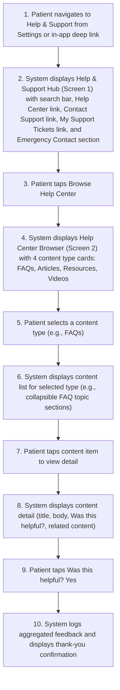
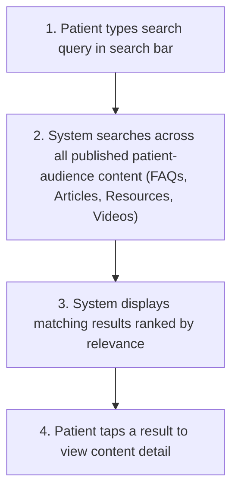
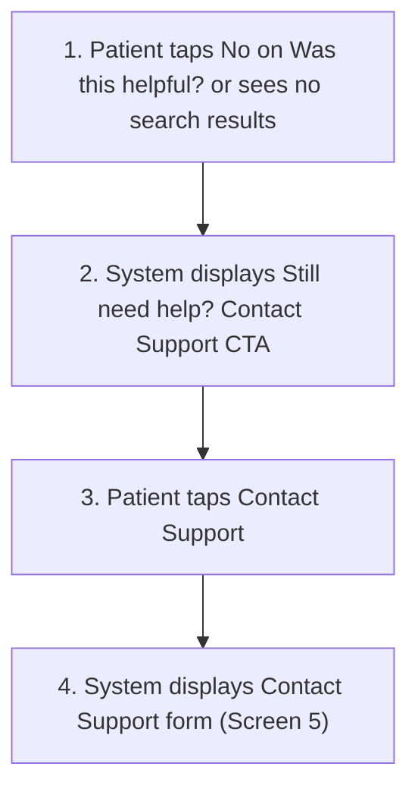
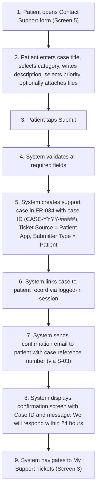
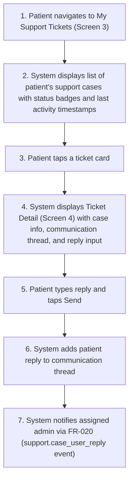
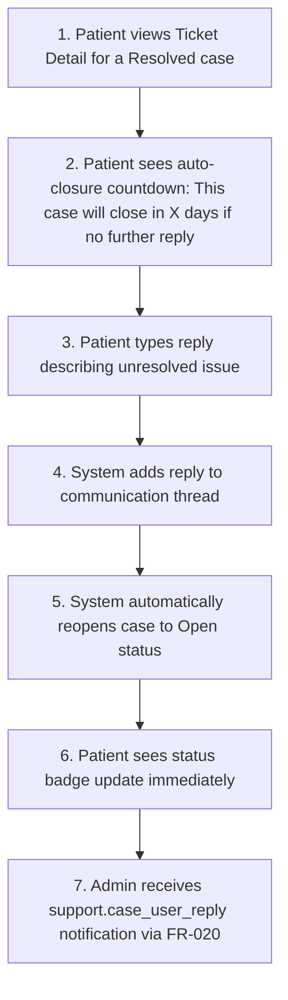
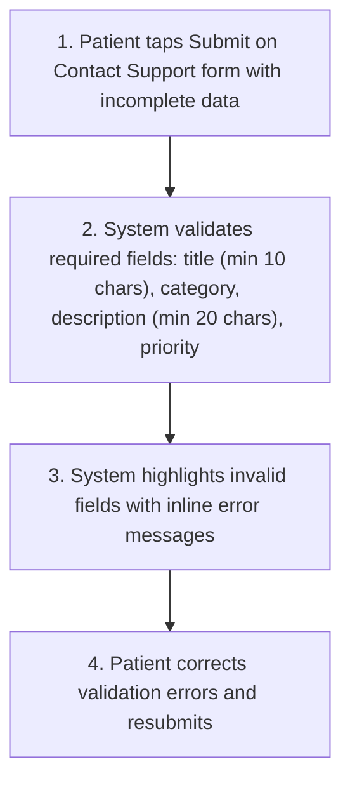
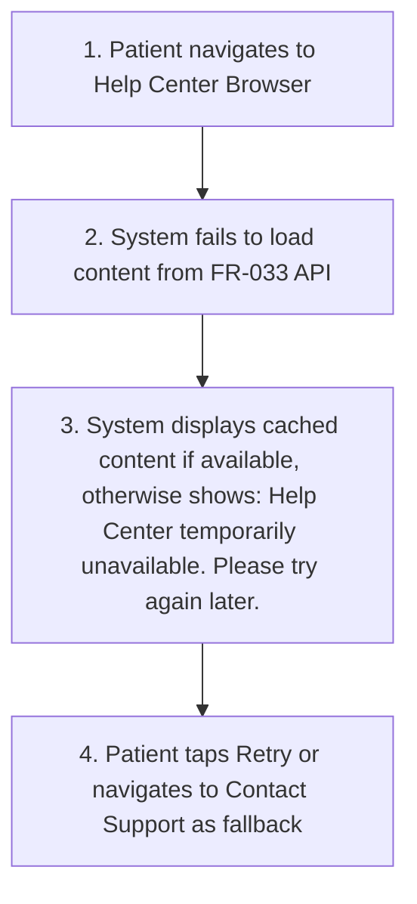

# FR-035 - Patient Help Center & Support Submission

**Module**: P-08: Help Center & Support Access | Integrates with FR-033 (Help Centre Content Management) and FR-034 (Support Center & Ticketing System)
**Feature Branch**: `fr035-patient-help-support`
**Created**: 2026-03-06
**Status**: Draft
**Source**: FR-035 from system-prd.md, Client transcriptions (HairlineApp-Part2.txt, Hairline-AdminPlatform-Part1.txt, Hairline-ProviderPlatformPart2.txt), missing-mobile-flows-design-complement.md (Flow P08.1)

---

## Executive Summary

The Patient Help Center & Support Submission module provides the patient-facing interface for accessing self-service help content and submitting support requests directly from the patient mobile app. This feature acts as the patient-side reading layer for Help Centre content managed by admins via FR-033, and as the patient-side submission interface for support cases managed via FR-034.

**Key Objectives**:

- Provide patients with 24/7 access to self-service help resources (FAQs, articles, resources, videos) tailored to the patient audience
- Enable patients to submit support requests, feedback, and feature requests directly from the mobile app, creating tracked cases in FR-034
- Enable two-way threaded communication between patients and admin support staff within support cases
- Reduce support ticket volume by enabling patients to find answers independently before contacting support
- Maintain complete content isolation: patients see only patient-audience content, never provider content

**Problem Solved**: Without a dedicated patient-facing help center, patients must rely on external channels (email, phone) for support — leading to slower response times, lost inquiries, and no self-service path. This module ensures patients can find answers independently and, when needed, submit tracked support requests with full two-way communication and status visibility.

**Business Value**:

- **Improved Patient Satisfaction**: Immediate access to self-service answers and transparent ticket tracking with two-way communication
- **Reduced Support Load**: Self-service content deflects common questions, allowing admin staff to focus on complex issues
- **Complete Multi-Tenant Support**: Completes the support architecture across all three platforms (Patient via FR-035, Provider via FR-032, Admin via FR-034)
- **Compliance & Audit Trail**: All support interactions tracked with case IDs, timestamps, and communication history via FR-034
- **Healthcare Safety**: Emergency contact information always accessible for post-procedure patient safety

---

## Module Scope

### Multi-Tenant Architecture

- **Patient Platform (P-08)**: Full patient-facing Help Center experience — browse help content, search, submit support requests and feedback, view and manage support tickets with two-way communication
- **Provider Platform (PR-XX)**: Not applicable (providers access help via FR-032)
- **Admin Platform (A-XX)**: Not applicable (admins manage content via FR-033, manage tickets via FR-034)
- **Shared Services (S-03)**: Notification Service for support case email notifications (status changes, admin replies, case closure)

### Multi-Tenant Breakdown

**Patient Platform (P-08)**:

- Patients access Help Center from patient mobile app navigation (Settings screen or in-app deep links)
- Patients browse help content organized by 4 content types: FAQs, Articles (Tutorial Guides + Troubleshooting Tips), Resources, Videos
- Patients search across all published patient-audience help content
- Patients view content detail with "Was this helpful?" feedback
- Patients submit support requests via Contact Support form, creating tracked cases in FR-034
- Patients view their submitted support tickets with status, priority, and communication thread
- Patients reply to admin messages within support cases (two-way threaded communication)
- Patients receive email and push notifications on case status changes and admin replies (via FR-020, S-03)

**Provider Platform (PR-XX)**:

- Not applicable — provider help center is handled by FR-032

**Admin Platform (A-XX)**:

- Not applicable — content management is handled by FR-033, ticket management by FR-034
- Admin actions that affect patient experience: publishing/unpublishing content (FR-033), responding to patient cases (FR-034), updating case status (FR-034)

**Shared Services (S-03)**:

- Sends email notifications to patients when support case status changes (Open -> In Progress, In Progress -> Resolved, Resolved -> Closed)
- Sends email notifications to patients when admin replies to their case
- Sends case closure notification when auto-closure period expires

### Communication Structure

**In Scope**:

- Patient browsing and reading admin-published Help Center content (read-only consumption of FR-033 content)
- Patient submitting support requests and feedback via Contact Support form (creates cases in FR-034)
- Patient viewing support ticket status, communication thread, and case details
- Patient replying to admin messages within support cases (two-way threaded communication via FR-034)
- Patient receiving notifications on case updates (via FR-020, S-03)
- Patient providing "Was this helpful?" feedback on help content (aggregated, anonymous)

**Out of Scope**:

- Help Center content creation, editing, publishing (handled by FR-033: Help Centre Content Management)
- Support case management, assignment, escalation, resolution (handled by FR-034: Support Center & Ticketing)
- Real-time in-app chat between patient and admin (future enhancement)
- Service Status page (provider-only feature per FR-033)
- Aftercare-specific communications (handled by FR-011: Aftercare & Recovery Management)
- Provider-to-patient secure messaging (handled by FR-012: Secure Messaging)
- Automated chatbot responses (future enhancement)
- Community forum (future enhancement)

### Entry Points

- Patient navigates to "Help & Support" from Settings screen (FR-026 / P01.2-S1)
- In-app deep link from other screens (e.g., contextual help links from booking, payment, or aftercare screens)
- Push notification tap (e.g., tapping a case status change notification navigates to Ticket Detail)

---

## Business Workflows

### Main Flow: Patient Accesses Help Center and Finds Answer

**Actors**: Patient, System, FR-033 Help Centre Content Service
**Trigger**: Patient navigates to Help & Support from Settings or in-app deep link
**Outcome**: Patient finds answer to their question via self-service content

**Flow Diagram**:

### Alternative Flows

**A1: Patient Searches for Help Content**

- **Trigger**: Patient types in search bar on Help & Support Hub or Help Center Browser
- **Outcome**: Patient finds relevant content via search results

**A2: Patient Cannot Find Answer and Contacts Support**

- **Trigger**: Patient searches and gets no results, or taps "No" on "Was this helpful?"
- **Outcome**: Patient is routed to Contact Support form

**A3: Patient Submits Support Request**

- **Trigger**: Patient taps Contact Support from Hub, Ticket List, or after unsuccessful help search
- **Outcome**: Support case created in FR-034, patient receives confirmation

**A4: Patient Views and Replies to Support Ticket**

- **Trigger**: Patient taps a ticket from My Support Tickets list
- **Outcome**: Patient views case detail and replies to admin message

**A5: Patient Replies to Resolved Case (Auto-Reopen)**

- **Trigger**: Patient replies to a case with status "Resolved" during the auto-closure window
- **Outcome**: Case automatically reopens to "Open" status

**B1: Contact Support Form Validation Fails**

- **Trigger**: Patient attempts to submit Contact Support form with missing or invalid fields
- **Outcome**: Patient corrects errors and resubmits

**B2: Help Center Content Unavailable**

- **Trigger**: API error prevents loading Help Center content
- **Outcome**: Patient sees error state with retry option and Contact Support fallback

---

## Screen Specifications

### Screen 1: Help & Support Hub

**Purpose**: Central entry point for all help resources and support channels

**Data Fields**:

| Field Name | Type | Required | Description | Validation Rules |
|------------|------|----------|-------------|------------------|
| Screen Title | text | Yes | "Help & Support" | Displayed at top of screen |
| Back Navigation | action | Yes | Back arrow to return to Settings or previous screen | Top-left corner |
| Search Bar | text | Yes | "Search help articles..." placeholder; full-text search across all published patient-audience FAQ and article content | Results appear inline or on a separate results screen; scoped to patient audience only (FR-033 Rule 3); relevance-ranked results are required for P1 |
| Browse Help Center | link | Yes | Row with book/article icon + "Help Center" label + chevron | Navigates to Screen 2; covers 4 content types: FAQs, Articles (Tutorial Guides + Troubleshooting Tips), Resources, Videos (FR-033 REQ-033-003) |
| Contact Support | link | Yes | Row with headset/message icon + "Contact Support" label + chevron | Opens Contact Support form (Screen 5), creating new ticket via FR-034 |
| My Support Tickets | link | Yes | Row with ticket icon + "My Support Tickets" label + chevron + open ticket count badge | Navigates to Screen 3; badge shows count of open/in-progress tickets |
| Emergency Contact Section | group | Yes | Always-visible section at bottom of screen with emergency contact details | Must remain visible regardless of scroll position (sticky or always rendered) |
| — Emergency Phone | text | Yes | Emergency phone number for urgent post-treatment concerns | Read-only; tap-to-call on mobile |
| — Emergency Email | text | Yes | Emergency email address | Read-only; tap-to-compose on mobile |

**Business Rules**:

- All Help Center content is read-only for patients; it is managed exclusively by admins via FR-033 and scoped to the patient audience (FR-033 REQ-033-008)
- Search covers all published patient-audience articles and FAQs; results are ranked by relevance; if no results match, show a "Contact Support" prompt. Full-text search is required for P1 and must not be downgraded to browse-only behavior.
- **[Design Addition — not in FR-033/FR-034]** Emergency contact section is a healthcare UX best practice for post-procedure patient safety; it must always be visible — it cannot be hidden or require scrolling past it. Emergency phone and email values should be configurable by admin via FR-026 (App Settings) or a future dedicated FR.
- Support ticket creation follows FR-034 Workflow A5; submissions automatically create cases with Ticket Source = "Patient App" and Submitter Type = "Patient" (FR-034 REQ-034-024)
- "My Support Tickets" badge count reflects open + in-progress tickets only; hidden when count is 0

---

### Screen 2: Help Center Browser

**Purpose**: Browse patient-facing help content organized by content type, search articles, and view content detail

**Data Fields**:

| Field Name | Type | Required | Description | Validation Rules |
|------------|------|----------|-------------|------------------|
| Screen Title | text | Yes | "Help Center" | Displayed at top of screen |
| Back Navigation | action | Yes | Back arrow to return to Help & Support Hub (Screen 1) | Top-left corner |
| Search Bar | text | Yes | Full-text search across all patient-audience help content. | Auto-suggests results while typing; scoped to patient audience (FR-033 Rule 3); required for P1 |
| Content Type Cards | group | Yes | Tappable content type tiles (4 content types for patient platform per FR-033 REQ-033-003) | Content types: FAQs, Articles, Resources, Videos; no Service Status for patients. Articles content type contains subtypes: Tutorial Guides, Troubleshooting Tips — shown as secondary filters within the Articles list view |
| — Content Type Icon | icon | Yes | Icon representing the content type | Visual differentiator per content type |
| — Content Type Label | text | Yes | Content type name | Read-only |
| — Item Count Badge | badge | No | Number of published items in the content type | Read-only; hidden if count is 0 |
| — Empty Content Type State | group | Conditional | Shown when a content type has 0 published items | Content type card is shown but greyed out / disabled with label "No content available yet"; tapping shows empty state message |
| Featured / Popular Articles | list | No | **[Design Addition]** Curated shortlist of popular or featured articles | Not defined in FR-033; requires admin curation mechanism or auto-generation based on view analytics (FR-033 REQ-033-018). Up to 5 items. |
| Content Unavailable State | group | Conditional | Shown when Help Center content cannot be loaded (API unavailable) | "Help Center temporarily unavailable. Please try again later." with retry button. Alternatively, display cached content if available. |

**Content Type: FAQs (FR-033 REQ-033-006)**

| Field Name | Type | Required | Description | Validation Rules |
|------------|------|----------|-------------|------------------|
| FAQ Topic Sections | group | Yes | Collapsible accordion sections organized by topic (FR-033 REQ-033-006) | Topics are admin-defined via FR-033; each section header shows topic name + item count; tapping expands/collapses the section |
| — FAQ Item | group | Yes | Individual FAQ entry within a topic section | Tapping expands the answer inline (accordion style) or navigates to FAQ detail |
| — FAQ Question | text | Yes | The question text | Bold; always visible as accordion header |
| — FAQ Answer | text | Yes | The answer text (rich text) | Shown on expand; supports formatted text and inline images |
| — "Was this helpful?" | group | Yes | Binary feedback on the FAQ answer | Same behavior as Article Detail feedback (see below) |

**Content Type: Articles (Tutorial Guides + Troubleshooting Tips)**

| Field Name | Type | Required | Description | Validation Rules |
|------------|------|----------|-------------|------------------|
| Article Subtype Filter | chips | Yes | Filter chips: "All", "Tutorial Guides", "Troubleshooting Tips" | "All" default; filters the article list by subtype |
| Article List | list | Yes | Full list of published articles for the selected subtype | Shown after patient selects Articles content type |
| — Item Title | text | Yes | Article title | Tappable; navigates to article detail |
| — Item Excerpt | text | No | 1-2 line description or preview | Truncated with ellipsis |
| — Last Updated | datetime | No | Date content was last published or updated | Relative or short date format |
| Article Detail — Title | text | Yes | Full article title | Read-only |
| Article Detail — Body | text | Yes | Full article/guide content (rich text, scrollable) | Read-only; supports formatted text, inline images |
| Article Detail — "Was this helpful?" | group | Yes | Binary feedback: "Yes" / "No" buttons; displays "Thank you for your feedback" confirmation on tap | Feedback is aggregated at the content level — admin dashboards show total Yes/No counts per article. Individual patient identity is not stored with feedback responses per FR-033 Privacy Rule 2 ("aggregated for patients, not individual user level"). |
| Article Detail — Contact Support CTA | link | Conditional | "Still need help? Contact Support" shown after patient taps "No" on helpfulness | Routes to Contact Support form Screen 5 (FR-034) |
| Article Detail — Related Articles | list | No | 2-4 related content items suggested by the system | Admin-configured via FR-033; may link across content types (e.g., article linking to a related video tutorial); tappable |

**Content Type: Resources (Resource Library)**

| Field Name | Type | Required | Description | Validation Rules |
|------------|------|----------|-------------|------------------|
| Resource List | list | Yes | List of downloadable resources (PDFs, documents) | Shown after patient selects Resources content type |
| — File Title | text | Yes | Resource file title | Tappable; navigates to resource detail |
| — File Type Icon | icon | Yes | Icon indicating file format (PDF, DOC, etc.) | Visual differentiator by format |
| — File Size | text | Yes | File size display (e.g., "2.4 MB") | Read-only |
| — Last Updated | datetime | No | Date resource was last published or updated | Relative or short date format |
| Resource Detail — Title | text | Yes | Full resource title | Read-only |
| Resource Detail — File Preview | group | Yes | In-app preview of the file (PDF viewer, document viewer) | Read-only; scrollable; shows at least the first page |
| Resource Detail — Download Button | action | Yes | Download file to device | Tap initiates download; shows progress indicator; saves to device downloads folder |
| Resource Detail — "Was this helpful?" | group | Yes | Binary feedback on the resource | Same aggregated feedback behavior as articles |

**Content Type: Video Tutorials**

| Field Name | Type | Required | Description | Validation Rules |
|------------|------|----------|-------------|------------------|
| Video List | list | Yes | List of published video tutorials | Shown after patient selects Videos content type |
| — Video Thumbnail | image | Yes | Preview thumbnail of the video | Tappable; navigates to video detail |
| — Video Title | text | Yes | Video tutorial title | Displayed below or beside thumbnail |
| — Video Duration | text | Yes | Video length (e.g., "3:45") | Read-only |
| — Last Updated | datetime | No | Date video was last published or updated | Relative or short date format |
| Video Detail — Embedded Player | video | Yes | In-app video player with play/pause, seek, fullscreen controls | Streams video content; supports standard playback controls |
| Video Detail — Title | text | Yes | Full video title | Read-only; displayed below player |
| Video Detail — Description | text | Yes | Video description (rich text) | Read-only; scrollable |
| Video Detail — Transcript Link | link | No | Link to view video transcript | Opens transcript in a scrollable text view; accessibility best practice |
| Video Detail — "Was this helpful?" | group | Yes | Binary feedback on the video | Same aggregated feedback behavior as articles |

**General Content List (shared across content types)**

| Field Name | Type | Required | Description | Validation Rules |
|------------|------|----------|-------------|------------------|
| No Results State | group | Conditional | Shown when search returns 0 results | "No results for '[query]'. Try different keywords or Contact Support." |
| Empty Content State | group | Conditional | Shown when a content type has no published items | "No [content type] available yet. Check back later or Contact Support." |

**Business Rules**:

- All content data is managed by admins via FR-033 and delivered to patients via FR-035; patients have read-only access with no ability to create, edit, or delete content (FR-033 Rule 2, REQ-033-008)
- Patient content is completely isolated from provider content — patients only see patient-audience content (FR-033 Rule 1, Rule 3, REQ-033-021)
- Search is scoped to the patient audience repository; results are ranked by relevance; empty search results must always surface a "Contact Support" path. This search behavior is required for P1.
- "Was this helpful?" feedback is aggregated at the content level — admin dashboards show total Yes/No counts per content item. Per FR-033 Privacy Rule 2, patient analytics are aggregated and not tracked at individual user level. Feedback responses do not store individual patient identity.
- Content updates published by admin propagate to patient view within 1 minute (FR-033)
- FAQ content must be displayed in collapsible topic sections per FR-033 REQ-033-006, not as a flat list
- Related content suggestions may cross content types (e.g., an article may link to a related video tutorial); the relationship is admin-configured via FR-033
- When Help Center content is unavailable (API down), display cached content if available or show "Help Center temporarily unavailable" with a retry option

---

### Screen 3: My Support Tickets

**Purpose**: List all support cases submitted by the patient, with ability to create new tickets

**Data Fields**:

| Field Name | Type | Required | Description | Validation Rules |
|------------|------|----------|-------------|------------------|
| Screen Title | text | Yes | "My Support Tickets" | Displayed at top of screen |
| Back Navigation | action | Yes | Back arrow to return to Help & Support Hub (Screen 1) | Top-left corner |
| Create New Ticket Button | action | Yes | Primary CTA to submit a new support request | Opens Contact Support Form (Screen 5); on successful submission, displays confirmation then returns to this ticket list (Screen 3); always visible |
| Filter Chips | chips | Yes | Filter ticket list: All, Open, In Progress, Resolved, Closed | "All" is default; tapping a chip filters the list. Resolved and Closed are **separate** chips because Resolved cases still accept patient replies (7-day auto-closure window), while Closed cases are read-only (FR-034 REQ-034-003). |
| Ticket Card | group | Yes | Individual support case summary row (tappable) | Tapping navigates to Ticket Detail view (Screen 4) |
| — Case ID | text | Yes | Unique case reference (format: CASE-YYYY-#####) | Read-only; displayed in subdued style |
| — Title | text | Yes | Case title of the support request (FR-034 REQ-034-020) | Bold; truncated to 1-2 lines |
| — Status Badge | badge | Yes | Current lifecycle status: Open, In Progress, Resolved, Closed | Color-coded: Open (blue), In Progress (amber), Resolved (green), Closed (grey) |
| — Priority Badge | badge | Yes | Priority level: Low, Medium, High, Urgent | Color-coded: Low (grey), Medium (blue), High (orange), Urgent (red); shown alongside status badge for at-a-glance triage awareness |
| — Submitted Date | datetime | Yes | Date the ticket was submitted | Short date format |
| — Last Updated | datetime | Yes | Timestamp of last activity (admin reply, status change) | Relative format: "2h ago", "Yesterday" |
| Empty State | group | Conditional | Shown when patient has no tickets (or none match filter) | "No support tickets yet. Need help? Tap 'Create New Ticket'." |

**Business Rules**:

- Tickets are ordered by most recently updated (newest activity at top) within each filter tab
- All statuses (Open, In Progress, Resolved, Closed) are visible in "All"; filter chips narrow the view per status group
- Creating a new ticket follows FR-034 Workflow A5: patient enters title (10-200 chars, mandatory), selects category (Technical Issue, Account Access, Payment Question, Booking Issue, General Inquiry, Feature Request, Bug Report, Feedback — "Provider Support" and "Patient Support" are admin-internal categories not shown to patients), enters description (20-5000 chars), selects priority (Low, Medium, High, Urgent), and optionally attaches files (max 5 files, 10 MB each, JPG/PNG/PDF/DOC/DOCX); system creates case with Ticket Source = "Patient App", Submitter Type = "Patient" (FR-034 REQ-034-021, REQ-034-024)
- Patient receives a confirmation email with the case reference number upon submission (FR-020, FR-034 A5 step 11)
- Ticket cards are always tappable regardless of status — patients can view the full thread even for Closed cases
- Resolved cases display a subtle "Auto-closes in X days" indicator to set expectations about the closure window (FR-034 REQ-034-061)

---

### Screen 4: Ticket Detail View

**Purpose**: Full support case detail with communication thread and patient reply capability

**Data Fields**:

| Field Name | Type | Required | Description | Validation Rules |
|------------|------|----------|-------------|------------------|
| Screen Title | text | Yes | Case title (FR-034 REQ-034-020) | Displayed at top of screen |
| Back Navigation | action | Yes | Back arrow to return to My Support Tickets (Screen 3) | Top-left corner |
| Case ID | text | Yes | Unique case reference (CASE-YYYY-#####) | Read-only |
| Status Badge | badge | Yes | Current case status: Open, In Progress, Resolved, Closed | Color-coded per status (same palette as Screen 3) |
| Priority Badge | badge | Yes | Priority level: Low, Medium, High, Urgent | Color-coded: Low (grey), Medium (blue), High (orange), Urgent (red); read-only |
| Case Category | badge | Yes | Selected category (e.g., "Account Access", "Payment Question") | Read-only |
| Submitted Date | datetime | Yes | Date and time case was submitted | Read-only |
| Auto-Closure Countdown | text | Conditional | "This case will close in X days if no further reply" | Shown only when status = Resolved; displays remaining days in auto-closure window (FR-034 REQ-034-061, configurable: 3/7/14 days, default 7). Helps patient understand the urgency of replying if their issue persists. Hidden for Open, In Progress, and Closed statuses. |
| Resolution Summary | text | Conditional | Admin-provided resolution summary displayed when case is resolved or closed (FR-034 REQ-034-059, REQ-034-060) | Read-only; shown only when status = Resolved or Closed and admin has entered a resolution summary. Displayed prominently above the communication thread with a "Resolution" header. The resolution summary is also sent to the patient via email notification on status change to Resolved. |
| Feedback Resolution | badge | Conditional | For feedback/feature request cases only: Implemented, Planned, Declined, Under Review | Read-only; shown only when admin has set a feedback resolution value (FR-034 REQ-034-006) |
| Communication Thread | list | Yes | Chronological list of all messages (admin replies + patient messages) | Scrollable; newest message at bottom; messages marked with sender label (You / Support Team) |
| — Message Sender | text | Yes | Label: "You" for patient messages, "Support Team" for admin replies | Read-only |
| — Message Body | text | Yes | Full message content | Read-only for admin messages; supports plain text |
| — Message Timestamp | datetime | Yes | Date and time message was sent | Relative or absolute format |
| — Attachment | file | Conditional | Attached screenshot or document within message | Read-only; tap to view full-size or download; max 10 MB per file, formats: JPG, PNG, PDF, DOC, DOCX (FR-034 REQ-034-036/037) |
| Reply Input Field | text | Conditional | Multi-line text input for patient to reply to admin | Shown when case is Open, In Progress, or **Resolved** (FR-034 REQ-034-026); hidden **only** for Closed cases. Replying to a Resolved case triggers automatic reopening to Open status. |
| Attachment Button | action | Conditional | Button to attach files to reply | Shown alongside Reply Input Field; max 10 MB per file, formats: JPG/PNG/PDF/DOC/DOCX. **[Clarification Needed]** FR-034 REQ-034-036 specifies "maximum 5 files per case" — confirm whether the limit is per-submission or per-case-lifetime. |
| Send Reply Button | action | Conditional | Submits patient reply to the case thread | Enabled when reply input is non-empty; hidden for Closed cases; admin notified on send via FR-020 (support.case_user_reply) |
| Closed Case Banner | group | Conditional | Informational banner shown when case is Closed | "This case is closed. If you still need help, you can create a new ticket or contact support to request this case be reopened." with "Create New Ticket" link to Screen 5 and "Contact Support" link (email/phone from Emergency Contact Section in Screen 1). Provides both paths: new ticket creation (in-app) and case reopening via admin (FR-034 Workflow B3, REQ-034-063, REQ-034-017). |
| Empty Thread State | text | Conditional | Shown when no messages exist yet (case just created) | "Your case has been submitted. Our team will respond within 24 hours." (aligns with FR-034 SC-003) |

**Business Rules**:

- Patients can reply to admin messages when the case is Open, In Progress, or **Resolved** (FR-034 REQ-034-026); **only Closed** cases are fully read-only. This is critical for healthcare — patients must be able to report that a resolved issue has recurred (e.g., post-treatment complications) during the auto-closure window.
- Replying to a Resolved case automatically reopens it to Open status; the patient sees the status badge update immediately and the admin receives a support.case_user_reply notification via FR-020
- Cases auto-close after 7 days in Resolved status if no patient reply (configurable: 3/7/14 days per FR-034 REQ-034-061/062); the patient receives a support.case_closed notification. The auto-closure countdown is visible in the Ticket Detail to set clear expectations.
- Patient replies are added to the shared communication thread and the assigned admin receives a notification via FR-020 (support.case_user_reply event)
- Internal admin notes are never shown to the patient — only messages explicitly sent to the patient are visible in the thread (FR-034 REQ-034-013, REQ-034-046)
- Feedback resolution field is only shown for feedback, feature request, or bug report case categories (FR-034 REQ-034-006); values: Implemented, Planned, Declined, Under Review
- Status changes (Open -> In Progress, In Progress -> Resolved, Resolved -> Closed) trigger push/email notifications to the patient per FR-020 (support.case_status_changed, support.case_resolved, support.case_closed)

---

### Screen 5: Contact Support Form

**Purpose**: Structured form for patients to submit new support requests or feedback, creating a tracked case in FR-034

**Data Fields**:

| Field Name | Type | Required | Description | Validation Rules |
|------------|------|----------|-------------|------------------|
| Screen Title | text | Yes | "Contact Support" | Displayed at top of screen |
| Back Navigation | action | Yes | Back arrow to return to previous screen (Hub or Ticket List) | Top-left corner; prompts "Discard draft?" confirmation if form has unsaved input |
| Case Title | text | Yes | Patient-entered title describing their issue (FR-034 REQ-034-020) | Min 10 characters, max 200 characters; no auto-generation; placeholder: "Briefly describe your issue" |
| Category Picker | dropdown | Yes | Support case category selection | Options: Technical Issue, Account Access, Payment Question, Booking Issue, General Inquiry, Feature Request, Bug Report, Feedback (FR-034 REQ-034-030). "Provider Support" and "Patient Support" are admin-internal categories and are not shown to patients. Brief inline description per category to help patients select correctly: Feature Request = "Suggest a new feature or improvement", Bug Report = "Report something that is broken or not working as expected", Feedback = "Share general feedback about your experience". |
| Description | text | Yes | Detailed description of the issue or feedback | Multi-line input; min 20 characters, max 5000 characters (FR-034 REQ-034-035); placeholder: "Describe your issue in detail so we can help you faster" |
| Priority Picker | dropdown | Yes | Patient-selected priority level | Options: Low, Medium, High, Urgent (FR-034 REQ-034-031); default: Medium. Brief inline descriptions help patients self-triage: Low = "General question", Medium = "Something isn't working right", High = "Blocking my care or booking", Urgent = "Critical issue needing immediate attention" |
| Attachments | file | No | Optional file attachments (screenshots, documents) | Max 5 files per submission, max 10 MB per file; accepted formats: JPG, PNG, PDF, DOC, DOCX (FR-034 REQ-034-036/037); tap to add; shows thumbnail preview with remove option; virus-scanned before acceptance. **[Clarification Needed]** FR-034 REQ-034-036 says "maximum 5 files per case" — confirm whether this is per-submission or cumulative across the case lifecycle. |
| Submit Button | action | Yes | Submits the support request | Disabled until all required fields pass validation; on tap: creates case (CASE-YYYY-#####), links to patient record via session (FR-034 REQ-034-024), sets Ticket Source = "Patient App" and Submitter Type = "Patient", sends confirmation email (FR-034 A5 step 11) |
| Cancel / Discard | action | Yes | Cancels form and returns to previous screen | Prompts "Discard this request?" if any field has input; no data saved on cancel |

**Business Rules**:

- All fields except Attachments are mandatory; the Submit button remains disabled until Title (>= 10 chars), Category, Description (>= 20 chars), and Priority are all valid
- Upon successful submission, the system displays a confirmation screen showing the assigned Case ID (CASE-YYYY-#####) and the message "We will respond within 24 hours" (FR-034 SC-003), then navigates to My Support Tickets (Screen 3)
- File uploads are validated client-side (format + size) before upload and server-side (virus scan + format whitelist) before acceptance (FR-034 REQ-034-036/037)
- Category selection drives downstream admin routing — this is transparent to the patient but important for response time
- Priority inline descriptions are a healthcare UX pattern to reduce mis-triage; patients in distress tend to over-select "Urgent" without guidance, which degrades response quality for truly urgent cases
- **[Design Addition]** Category inline descriptions (Feature Request, Bug Report, Feedback) help patients distinguish between overlapping categories — all three appear in FR-034 REQ-034-030 but without patient-facing guidance on when to use each

---

## Business Rules

### General Module Rules

- **Rule 1**: All Help Center content is read-only for patients; content is managed exclusively by admins via FR-033 (REQ-033-008)
- **Rule 2**: Patient content is completely isolated from provider content — patients only see patient-audience content (FR-033 Rule 1, Rule 3, REQ-033-021)
- **Rule 3**: Support ticket submissions automatically create cases in FR-034 with Ticket Source = "Patient App" and Submitter Type = "Patient" (FR-034 REQ-034-024)
- **Rule 4**: Content updates published by admin propagate to patient view within 1 minute (FR-033)
- **Rule 5**: All timestamps displayed in user's local timezone

### Data & Privacy Rules

- **Privacy Rule 1**: "Was this helpful?" feedback is aggregated at the content level — admin dashboards show total Yes/No counts per content item. Individual patient identity is not stored with feedback responses (FR-033 Privacy Rule 2)
- **Privacy Rule 2**: Internal admin notes within support cases are never shown to patients — only messages explicitly sent to the patient are visible (FR-034 REQ-034-013, REQ-034-046)
- **Privacy Rule 3**: Patient support case data is accessible only to the submitting patient and authorized admin staff
- **Privacy Rule 4**: File attachments in support cases are virus-scanned before acceptance and encrypted at rest
- **Audit Rule**: All support case lifecycle events (creation, status changes, messages, attachments) are logged with timestamp and user ID in FR-034 case timeline

### Admin Editability Rules

**Editable by Admin**:

- Help Center content (FAQs, articles, resources, videos) — managed via FR-033
- Support case status, assignment, resolution — managed via FR-034
- Auto-closure period for resolved cases (3/7/14 days, default 7 days) — configured via FR-034
- Emergency contact phone number and email — configurable via FR-026 (App Settings)
- Patient-facing category descriptions and category visibility — managed via FR-033

**Fixed in Codebase (Not Editable)**:

- 4 content types for patient platform: FAQs, Articles, Resources, Videos (FR-033 REQ-033-003)
- Support case lifecycle workflow: Open -> In Progress -> Resolved -> Closed
- Case ID format: CASE-YYYY-#####
- File attachment limits: max 10 MB per file, max 5 files per case, formats: JPG/PNG/PDF/DOC/DOCX
- Contact Support form validation: title min 10 chars, description min 20 chars

**Configurable with Restrictions**:

- Patient-visible support categories (admin cannot add or remove categories from the fixed list but may update labels in future)
- Content type visibility (admin can toggle content type visibility in FR-033 but cannot add new content types for patients)

---

## Success Criteria

### Patient Experience Metrics

- **SC-001**: Patients can access Help Center and find relevant content within 2 taps from Settings screen
- **SC-002**: 60% of patient support questions can be answered via Help Center self-service content, reducing direct support contacts
- **SC-003**: Patients can navigate Help Center and find answers to common questions in under 3 minutes (FR-033 SC-015)
- **SC-004**: 75% of patients rate Help Center content as "Helpful" via feedback buttons (FR-033 SC-016)
- **SC-005**: Patients can submit a complete support request in under 3 minutes via Contact Support form
- **SC-006**: 90% of patients successfully complete support request submission on first attempt without validation errors

### Support Interaction Metrics

- **SC-007**: Patients receive initial admin response to their support case within 24 hours for 80% of cases (FR-034 SC-003)
- **SC-008**: Patients can view real-time status updates for their submitted support cases
- **SC-009**: Two-way communication thread maintains full conversation context and history for each case
- **SC-010**: Patients who reply to Resolved cases see immediate status update to Open with no data loss

### System Performance Metrics

- **SC-011**: Help Center content loads in under 2 seconds for 95% of requests (FR-033 SC-009)
- **SC-012**: Support ticket submission completes within 2 seconds for 95% of requests
- **SC-013**: System supports 5000 concurrent patient accesses to Help Center without performance degradation (FR-033 SC-012)
- **SC-014**: File downloads (PDFs, videos) begin within 3 seconds of patient tap (FR-033 SC-011)
- **SC-015**: Zero data loss for submitted support requests and patient replies

### Business Impact Metrics

- **SC-016**: Average time to resolve patient support issues decreases by 20% due to self-service content availability (FR-033 SC-018)
- **SC-017**: 40% of patients access Help Center at least once per month for self-service support (FR-033 SC-020)
- **SC-018**: Support ticket volume for common questions (covered by Help Center content) decreases by 30% within 3 months of launch
- **SC-019**: 100% of patient support case lifecycle events logged for audit purposes

---

## Dependencies

### Internal Dependencies (Other FRs/Modules)

- **FR-033 / Module A-09**: Help Centre Content Management
  - **Why needed**: FR-035 consumes patient-specific Help Center content managed by admins in FR-033 (FAQs, Articles, Resources, Videos)
  - **Integration point**: Patient app fetches patient-specific Help Centre content via REST API; displays patient-facing content in read-only mode; content updates propagate within 1 minute

- **FR-034 / Module A-10**: Support Center & Ticketing System
  - **Why needed**: FR-035 creates support cases for patient submissions and provides two-way communication capability via FR-034 Communication Thread
  - **Integration point**: Patient Contact Support form submissions automatically create cases in FR-034 (Workflow A5); patient views case status, communication thread, and replies within FR-035 screens; all case management handled by FR-034

- **FR-020 / Module S-03**: Notifications & Alerts
  - **Why needed**: Patients receive push and email notifications for support case updates (status changes, admin replies, case closure)
  - **Integration point**: FR-034 triggers notification events (support.case_status_changed, support.case_resolved, support.case_closed, support.case_user_reply) routed through FR-020/S-03

- **FR-001 / Module P-01**: Patient Authentication & Profile
  - **Why needed**: Patient must be authenticated to access Help Center, submit support requests, and view their tickets
  - **Integration point**: Patient session provides patient ID for automatic case linking (FR-034 REQ-034-024)

- **FR-026 / Module P-01**: App Settings & Security
  - **Why needed**: Help & Support is accessed from Settings screen; emergency contact details may be configurable via App Settings
  - **Integration point**: Settings screen navigation includes "Help & Support" menu item linking to Screen 1

### External Dependencies (APIs, Services)

- **External Service 1**: Media Storage Service (S-05)
  - **Purpose**: Serve help content media (videos, PDFs, images) and store support case attachments
  - **Integration**: RESTful API calls for content retrieval and file upload
  - **Failure handling**: Display cached content if available; for file uploads, queue for retry and notify patient of delay

- **External Service 2**: Virus Scanning Service
  - **Purpose**: Scan patient-uploaded attachments for viruses and malware before storage
  - **Integration**: API call during file upload in Contact Support form and ticket replies
  - **Failure handling**: Quarantine uploads and notify admin; do not attach files to case until scan completes

### Data Dependencies

- **Entity 1**: Published patient-audience Help Center content
  - **Why needed**: Cannot display Help Center without published content from FR-033
  - **Source**: FR-033 patient content repository (FAQs, Articles, Resources, Videos)

- **Entity 2**: Patient account and authentication session
  - **Why needed**: Cannot link support cases to patient records without authenticated patient session
  - **Source**: FR-001 patient authentication module

- **Entity 3**: FR-034 support case management system
  - **Why needed**: Cannot create, track, or communicate within support cases without FR-034 backend
  - **Source**: FR-034 Support Center & Ticketing System

---

## Assumptions

### User Behavior Assumptions

- **Assumption 1**: Patients will proactively check Help Center for answers before contacting support (requires clear navigation and discoverability)
- **Assumption 2**: Majority of patients will access Help Center from mobile devices (iOS/Android patient app)
- **Assumption 3**: Patients prefer self-service content (FAQs, tutorials) over contacting support for common questions
- **Assumption 4**: Patients will use the "Was this helpful?" feedback feature, providing data to improve content quality

### Technology Assumptions

- **Assumption 1**: Patients use smartphones with camera capabilities (for capturing screenshots to attach to support requests)
- **Assumption 2**: Patients have intermittent internet connectivity — cached Help Center content should be available offline where feasible
- **Assumption 3**: Patient app supports in-app video playback (embedded player for video tutorials)
- **Assumption 4**: Patient app supports in-app PDF/document preview for resource downloads

### Business Process Assumptions

- **Assumption 1**: Admin team responds to patient support cases within 24 hours during business hours (FR-034 SC-003)
- **Assumption 2**: Help Center content is curated to avoid medical advice and focus on platform usage, appointment management, and general information (FR-033 Assumption 5)
- **Assumption 3**: Emergency contact phone and email values are configured by admin before FR-035 goes live
- **Assumption 4**: Patient-visible support categories (8 categories) are sufficient for initial launch; admin will not need to add custom categories

---

## Implementation Notes

### Technical Considerations

- **Architecture**: FR-035 is a pure consumer of FR-033 content APIs and FR-034 ticketing APIs — it does not manage its own content or case data. All business logic for content management lives in FR-033, all case lifecycle logic lives in FR-034.
- **Caching**: Help Center content should be cached locally on the patient device to support offline browsing and reduce API load. Cache invalidation should respect the 1-minute content propagation SLA from FR-033.
- **Content Delivery**: Videos and large resources should be served via CDN for performance. Video streaming should support adaptive bitrate for variable network conditions.
- **Search**: Full-text search, relevance ordering, and inline suggestions are required for the patient Help Center MVP scope.

### Integration Points

- **Integration 1**: FR-033 Content API (Patient endpoint)
  - **Data format**: JSON payload with content type, title, body (rich text/HTML), metadata, media URLs
  - **Authentication**: OAuth 2.0 bearer tokens (patient session)
  - **Error handling**: Display cached content on API failure; show "temporarily unavailable" with retry for uncached content

- **Integration 2**: FR-034 Ticketing API (Patient endpoint)
  - **Data format**: JSON payload with case title, category, description, priority, attachments, patient ID
  - **Authentication**: OAuth 2.0 bearer tokens (patient session)
  - **Error handling**: Retry with exponential backoff on 5xx errors; queue submission locally if offline

- **Integration 3**: FR-020/S-03 Notification Service
  - **Data format**: Push notification and email payloads for case events
  - **Authentication**: System-to-system service authentication
  - **Error handling**: Notification delivery failures do not block case operations; retry asynchronously

### Scalability Considerations

- **Current scale**: Expected 500 Help Center page views per day and 50 support ticket submissions per day at launch
- **Growth projection**: Plan for 5,000 daily page views and 200 daily ticket submissions within 12 months
- **Peak load**: Handle 10x normal load during promotional campaigns or post-major-update support spikes
- **Data volume**: Help Center content is managed by admins (bounded); support case data grows linearly with patient base

### Security Considerations

- **Authentication**: Patient must be authenticated to access Help Center content, submit support requests, and view tickets
- **Authorization**: Patients can only view their own support cases — no access to other patients' cases
- **Encryption**: All patient data encrypted in transit (TLS 1.3) and at rest; file attachments encrypted at rest
- **Audit trail**: All support case lifecycle events logged with timestamp, patient ID, and action type (managed by FR-034)
- **Threat mitigation**: Rate limiting on ticket submission and reply endpoints (max 10 submissions/hour/patient); file upload virus scanning; input sanitization for all text fields
- **Compliance**: Patient support data handling follows the same HIPAA/GDPR compliance requirements as all patient data in the platform

---

## User Scenarios & Testing

### User Story 1 - Patient Finds Answer via Help Center (Priority: P1)

A patient who has questions about post-treatment hair care navigates to the Help Center from their Settings screen, browses the FAQs section, expands the relevant topic, and finds the answer they need — all without submitting a support ticket.

**Why this priority**: Self-service content access is the primary value proposition of the Help Center and the most common user journey. Deflecting support tickets directly reduces operational costs.

**Independent Test**: Can be fully tested by navigating to Help Center, browsing content types, viewing content detail, and submitting "Was this helpful?" feedback.

**Acceptance Scenarios**:

1. **Given** a patient is on the Settings screen, **When** they tap "Help & Support", **Then** the Help & Support Hub (Screen 1) is displayed with search bar, Help Center link, Contact Support link, My Support Tickets link, and Emergency Contact section
2. **Given** a patient is on the Help & Support Hub, **When** they tap "Help Center", **Then** the Help Center Browser (Screen 2) is displayed with 4 content type cards (FAQs, Articles, Resources, Videos)
3. **Given** a patient selects the FAQs content type, **When** the FAQ list loads, **Then** FAQs are displayed in collapsible accordion sections organized by admin-defined topics (FR-033 REQ-033-006)
4. **Given** a patient reads an FAQ answer, **When** they tap "Yes" on "Was this helpful?", **Then** the system logs aggregated positive feedback and displays "Thank you for your feedback"

---

### User Story 2 - Patient Submits Support Request (Priority: P1)

A patient encountering a payment issue cannot find an answer in the Help Center, so they navigate to Contact Support, fill out the form with their issue details, and submit it. They receive a confirmation with a case ID and can immediately see their new ticket in My Support Tickets.

**Why this priority**: Support ticket submission is the core fallback when self-service fails. Without it, patients have no in-app support path, which is unacceptable for a healthcare platform.

**Independent Test**: Can be fully tested by submitting a support request and verifying case creation in FR-034, confirmation display, and ticket appearance in My Support Tickets list.

**Acceptance Scenarios**:

1. **Given** a patient is on the Help & Support Hub, **When** they tap "Contact Support", **Then** the Contact Support form (Screen 5) is displayed with title, category, description, priority, and attachment fields
2. **Given** a patient fills all required fields (title >= 10 chars, category selected, description >= 20 chars, priority selected), **When** they tap Submit, **Then** the system creates a support case in FR-034 with CASE-YYYY-##### ID, Ticket Source = "Patient App", Submitter Type = "Patient"
3. **Given** a support case is created successfully, **When** submission completes, **Then** the patient sees a confirmation screen with the Case ID and "We will respond within 24 hours", and is navigated to My Support Tickets (Screen 3)
4. **Given** a patient has submitted a support request, **When** they view My Support Tickets, **Then** the new ticket appears at the top with status "Open" and the submitted details

---

### User Story 3 - Patient Communicates with Admin via Ticket Thread (Priority: P2)

A patient who submitted a support request receives a notification that admin has replied. They open the ticket, read the admin's response, type a follow-up question, and send it — continuing the conversation thread.

**Why this priority**: Two-way communication is essential for resolving complex support issues. Without it, patients must rely on external email for follow-ups, breaking the in-app experience.

**Independent Test**: Can be tested by viewing an existing ticket with admin replies, sending a patient reply, and verifying the reply appears in the thread and admin is notified.

**Acceptance Scenarios**:

1. **Given** a patient has a ticket with an admin reply, **When** they open the Ticket Detail (Screen 4), **Then** the communication thread shows all messages chronologically with sender labels ("You" / "Support Team") and timestamps
2. **Given** a patient is viewing a ticket with status Open or In Progress, **When** they type a reply and tap Send, **Then** the reply is added to the communication thread and the admin receives a support.case_user_reply notification
3. **Given** a patient is viewing a ticket with status Resolved, **When** they type and send a reply, **Then** the case automatically reopens to Open status, the status badge updates immediately, and the admin is notified

---

### User Story 4 - Patient Views Resolved Case with Auto-Closure (Priority: P2)

A patient's support case has been resolved by admin. The patient views the resolution summary, sees the auto-closure countdown, and decides whether to accept the resolution or reply to reopen the case.

**Why this priority**: The resolve-to-close lifecycle with auto-closure is critical for healthcare — patients must have a clear window to report recurring issues (e.g., post-treatment complications).

**Independent Test**: Can be tested by viewing a Resolved ticket showing resolution summary and auto-closure countdown, then either letting it auto-close or replying to reopen.

**Acceptance Scenarios**:

1. **Given** a patient has a ticket with status Resolved, **When** they open the Ticket Detail, **Then** they see the resolution summary above the thread and an auto-closure countdown ("This case will close in X days if no further reply")
2. **Given** a Resolved ticket's auto-closure period expires (7 days default), **When** the patient has not replied, **Then** the case automatically transitions to Closed and the patient receives a support.case_closed notification
3. **Given** a patient has a Closed ticket, **When** they open the Ticket Detail, **Then** the reply input is hidden and a Closed Case Banner is shown with options to create a new ticket or contact support to reopen

---

### User Story 5 - Patient Browses Video Tutorials and Downloads Resources (Priority: P3)

A patient preparing for their upcoming procedure browses the Help Center for educational content. They watch a video tutorial on post-treatment care and download a PDF guide for reference.

**Why this priority**: Rich content types (videos, resources) enhance the self-service experience but are secondary to core FAQ/article browsing and support ticket functionality.

**Independent Test**: Can be tested by navigating to Videos content type, playing a video, navigating to Resources, and downloading a PDF.

**Acceptance Scenarios**:

1. **Given** a patient selects the Videos content type, **When** the video list loads, **Then** each video shows thumbnail, title, and duration
2. **Given** a patient taps a video, **When** the video detail loads, **Then** the embedded player plays the video with standard controls (play/pause, seek, fullscreen) and shows title, description, and transcript link
3. **Given** a patient selects the Resources content type and taps a resource, **When** the resource detail loads, **Then** a file preview is shown with a download button, and tapping download saves the file to the device

---

### Edge Cases

- What happens when a patient submits a support request while offline? System should queue the submission locally and submit when connectivity is restored, with clear indication to the patient.
- How does the system handle a patient who uploads a file that fails virus scanning? The file is rejected with a message: "This file could not be attached. Please try a different file." No details about the scan failure are exposed to the patient.
- What happens when a patient views Help Center with no published content (e.g., first launch before admin populates content)? Each content type card shows "No content available yet. Check back later or Contact Support."
- How does the system handle a patient deleting their account while support cases are active? Open/In Progress cases should be flagged for admin review; patient identity is anonymized per data retention policy (FR-023).
- What happens when the auto-closure countdown reaches 0 while the patient is actively viewing the ticket? The status should update to Closed in real-time and the reply input should be replaced with the Closed Case Banner.

---

## Functional Requirements Summary

### Core Requirements

- **REQ-035-001**: System MUST display patient-specific Help Center content (FAQs, Articles, Resources, Videos) managed by admins in FR-033 as read-only resources (FR-033 REQ-033-003, REQ-033-008)
- **REQ-035-002**: System MUST enforce content isolation — patients see only patient-audience content, never provider content (FR-033 REQ-033-021)
- **REQ-035-003**: System MUST display FAQ content in collapsible accordion sections organized by admin-defined topics (FR-033 REQ-033-006)
- **REQ-035-004**: System MUST display article content with subtype filtering (Tutorial Guides, Troubleshooting Tips)
- **REQ-035-005**: System MUST support in-app video playback for video tutorials with play/pause, seek, and fullscreen controls
- **REQ-035-006**: System MUST support in-app file preview and download for resource documents
- **REQ-035-007**: System MUST provide "Was this helpful?" binary feedback on all content types, with feedback aggregated anonymously at the content level (FR-033 Privacy Rule 2)
- **REQ-035-008**: System MUST display related content suggestions (admin-configured via FR-033) that may cross content types

### Support Submission Requirements

- **REQ-035-009**: System MUST allow patients to submit support requests via Contact Support form with title (10-200 chars), category, description (20-5000 chars), priority, and optional file attachments (FR-034 REQ-034-020, REQ-034-030, REQ-034-031, REQ-034-035)
- **REQ-035-010**: System MUST automatically create support cases in FR-034 with Ticket Source = "Patient App" and Submitter Type = "Patient" on form submission (FR-034 REQ-034-021, REQ-034-024)
- **REQ-035-011**: System MUST link patient-submitted cases to patient records using logged-in patient session (FR-034 REQ-034-024)
- **REQ-035-012**: System MUST display 8 patient-visible categories: Technical Issue, Account Access, Payment Question, Booking Issue, General Inquiry, Feature Request, Bug Report, Feedback (FR-034 REQ-034-030; "Provider Support" and "Patient Support" excluded as admin-internal)
- **REQ-035-013**: System MUST support file attachments up to 10 MB per file, maximum 5 files per case, formats: JPG, PNG, PDF, DOC, DOCX (FR-034 REQ-034-036/037)
- **REQ-035-014**: System MUST virus-scan all patient-uploaded files before acceptance

### Ticket Management Requirements

- **REQ-035-015**: System MUST display patient's submitted support tickets with case ID, title, status (Open/In Progress/Resolved/Closed), priority, submitted date, and last updated timestamp
- **REQ-035-016**: System MUST support ticket filtering by status: All, Open, In Progress, Resolved, Closed
- **REQ-035-017**: System MUST display full communication thread for each ticket showing all messages from patient and admin with sender labels and timestamps
- **REQ-035-018**: System MUST allow patients to reply to admin messages when case is Open, In Progress, or Resolved (FR-034 REQ-034-026); reply input hidden only for Closed cases
- **REQ-035-019**: System MUST automatically reopen Resolved cases to Open status when patient sends a reply
- **REQ-035-020**: System MUST display auto-closure countdown on Resolved tickets showing remaining days before automatic closure (FR-034 REQ-034-061)
- **REQ-035-021**: System MUST display resolution summary when admin has provided one (FR-034 REQ-034-059, REQ-034-060)
- **REQ-035-022**: System MUST display Feedback Resolution status (Implemented, Planned, Declined, Under Review) for feedback/feature request/bug report cases when set by admin (FR-034 REQ-034-006)
- **REQ-035-023**: System MUST hide internal admin notes from patient view — only messages explicitly sent to the patient are visible (FR-034 REQ-034-013, REQ-034-046)

### Security & Privacy Requirements

- **REQ-035-024**: System MUST require patient authentication to access Help Center content, submit support requests, and view tickets
- **REQ-035-025**: System MUST ensure patients can only view their own support cases — no access to other patients' cases
- **REQ-035-026**: System MUST encrypt all patient data in transit (TLS 1.3) and at rest
- **REQ-035-027**: System MUST aggregate "Was this helpful?" feedback without storing individual patient identity (FR-033 Privacy Rule 2)

### Integration Requirements

- **REQ-035-028**: System MUST consume patient-specific Help Center content from FR-033 REST API with content updates reflected within 1 minute of admin publishing
- **REQ-035-029**: System MUST create support cases via FR-034 Ticketing API on patient form submission
- **REQ-035-030**: System MUST receive and display case status updates, admin replies, and resolution summaries from FR-034
- **REQ-035-031**: System MUST trigger patient notifications via FR-020/S-03 for case status changes, admin replies, and case closure

### Marking Unclear Requirements

- **REQ-035-032**: System MUST support file attachments with [NEEDS CLARIFICATION: FR-034 REQ-034-036 specifies "maximum 5 files per case" — confirm whether the 5-file limit is per-submission or cumulative across the entire case lifecycle (initial submission + all replies)]

---

## Key Entities

- **Entity 1 - Help Center Content Item**: A piece of patient-facing help content (FAQ, Article, Resource, Video) managed by admins in FR-033
  - **Key attributes**: content ID, content type (FAQ/Article/Resource/Video), title, body/file, topic/category, publish status, audience (always "Patient" for FR-035), last updated, helpfulness rating (aggregated Yes/No counts)
  - **Relationships**: One content item belongs to one content type; one FAQ belongs to one topic; content items may have related content links across types

- **Entity 2 - Support Case**: A patient-submitted support ticket managed by FR-034
  - **Key attributes**: case ID (CASE-YYYY-#####), title, category, description, priority, status (Open/In Progress/Resolved/Closed), ticket source ("Patient App"), submitter type ("Patient"), patient ID, assigned admin, resolution summary, feedback resolution, submitted date, last updated, auto-closure deadline
  - **Relationships**: One patient can have many support cases; one case has one communication thread with many messages; one case may have multiple file attachments

- **Entity 3 - Communication Message**: A message within a support case thread
  - **Key attributes**: message ID, case ID, sender type (Patient/Admin), message body, timestamp, attachments
  - **Relationships**: Many messages belong to one support case; messages ordered chronologically within the thread

---

## Appendix: Change Log

| Date | Version | Changes | Author |
|------|---------|---------|--------|
| 2026-03-06 | 1.0 | Initial PRD creation based on system-prd.md FR-035 definition, FR-033 content management integration, FR-034 ticketing integration, missing-mobile-flows-design-complement.md (Flow P08.1), and client transcriptions | Claude Code |

---

## Appendix: Approvals

| Role | Name | Date | Signature/Approval |
|------|------|------|---------------------|
| Product Owner | | | Pending |
| Technical Lead | | | Pending |
| Stakeholder | | | Pending |

---

**Template Version**: 2.0.0 (Constitution-Compliant)
**Constitution Reference**: Hairline Platform Constitution v1.0.0, Section III.B (Lines 799-883)
**Based on**: FR-035 from system-prd.md, FR-033 Help Centre Content Management, FR-034 Support Center & Ticketing System
**Last Updated**: 2026-03-06
